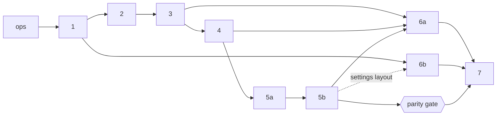

# Full Migration Design: Streamlit to FastAPI + Next.js (Index)

**Date:** 2026-09-25
**Status:** Draft for review. This is the index. The foundations spec and each slice spec are the binding detail. If this page disagrees with one of them, the linked spec wins.
**Inputs:** [Slice 0 spec](2026-09-25-react-fastapi-migration-design.md) (done, live) · [Migration inventory](2026-09-25-streamlit-migration-inventory.md) (source of truth for current behavior) · [Foundations](2026-09-25-migration-foundations-design.md) (cross-cutting conventions) · owner decisions 1–9.
**Amended 2026-09-26** with three owner-approved inputs, folded into the slice specs as marked amendments:
- [Service rubric](2026-09-25-service-rubric-design.md), PR #4. Merged; its behavior is current behavior (inventory D10, E9, G11, H13–H14).
- [Prayer library](2026-09-26-prayer-library-design.md), PR #7. New app only; built in slices 4 and 6a.
- [Service reviewer](2026-09-26-service-reviewer-design.md), PR #8. New app only; a small add-on right after slice 4.

---

## 1. Overview

The worship-service planning app moves from the Streamlit app (`app.py`, `streamlit_views/`, `ui_helpers.py`, `streamlit_auth.py`, `streamlit_tenancy.py`) to the FastAPI backend on Railway (`backend/api/`) and the Next.js 16 frontend on Vercel (`frontend/`), both already live from slice 0. Both apps share one Supabase Postgres database. The work is split into ten slices after slice 0. The ops slice secures production and freezes Streamlit on a `streamlit-frozen` branch, so from then on the database is the only contract between the two apps. Slice 1 adds onboarding and the shared platform: Alembic, the usecase and error layer, TanStack Query, layouts and the test harness. Slices 2–5b rebuild the Service Builder as a mobile-first flow of four steps (Date & readings → Hymns → Liturgy → Review & send), with a draft kept per church in the browser, the service archive, Word downloads and Gmail sending. After 5b, the tester moves to the new app at a parity gate. Slices 6a and 6b port the remaining Settings, and slice 7 retires Streamlit, rotates its secrets and runs the contract migrations it had blocked. The [foundations spec](2026-09-25-migration-foundations-design.md) sets the API shape, error codes, backend layering, migration rules, frontend architecture and testing strategy, so slice specs cover only their own features. The global constraints from slice 0 still hold: nothing under `backend/` imports Streamlit, secrets stay on the backend, every church-scoped route depends on `require_church`, errors use one body shape, sign-in is Google-only, work is test-first, and every layout starts at 375 px.

## 2. Product decisions (owner, binding)

1. **Step-by-step builder:** Date & readings → Hymns → Liturgy → Review & send. It has a progress indicator and is mobile-first. The unsaved draft is kept per church in the browser, and desktop shows a summary panel beside the current step.
2. **Liturgy as editable section cards.** Each card has Generate or Regenerate. Typed text is kept verbatim. Only empty cards that are switched on go to the AI.
3. **AI hymn suggestions:** each slot gets a top pick plus 2–4 one-tap alternatives. Suggestions respect the 12-week exclusion.
4. **Word documents:** both downloads (bulletin copy and pastor's copy) plus the bulletin email. The bulletin copy includes the sermon title. Documents are always regenerated from the latest service state.
5. **Roles:** members build, save, email and delete services (delete needs confirmation), edit hymns, and see the member list with emails. Admins also manage the church profile, prompts, translation, contacts, invites, roles and removals, but never the owner. Only the owner transfers ownership or deletes the church. Anyone can leave except the last admin.
6. **Invites** are single-use links by default (`/join?code=…`) with a Copy button. An optional "Reusable for 7 days" setting is available. Opening the link, signing in if needed, joins the church.
7. **Switchover:** freeze Streamlit now (data-safety fixes only), move the tester once slices 2–5 reach parity, and retire Streamlit right after slice 6.
8. **Any date** is allowed. The default is next Sunday in the church's time zone. Non-Sundays look up that date's own readings, and the user can type readings when there are none.
9. **Also approved:**
   - join or create more churches from the switcher;
   - liturgy generation without an OpenAI key;
   - a per-church default benediction, seeded with "Halverson";
   - no free-text hymns;
   - the readings bug fixes;
   - bulletin email in BCC with the sender in To and an editable message;
   - admins add bundled hymnals and set a default hymnal;
   - hymn usage replaced on save;
   - archived services keep custom elements and the hymnal;
   - Alembic introduced;
   - unsaved work kept in the browser.

## 3. Roadmap

Build order: ops → 1 → 2 → 3 → 4 → 5a → 5b → **parity gate** → 6a → 6b → 7. The 6b backend PR (6b-1) can be built in parallel any time after slice 1. Its UI PR (6b-2) merges after 5b. *Amendment 2026-09-26:* the service-reviewer add-on (PR #8) builds right after 4b, before 5a.

| Order | Slice | Goal | Depends on | Size | Spec |
|---|---|---|---|---|---|
| 0 | Slice 0: skeleton (**done**) | FastAPI + Next.js + Supabase Google auth live, with `/me`, `/church` and the church switcher | — | — | [spec](2026-09-25-react-fastapi-migration-design.md) |
| — | Foundations | Shared conventions for API, backend layering, Alembic, frontend architecture, testing and coexistence | 0 | — | [spec](2026-09-25-migration-foundations-design.md) |
| 1 | ops: Ops cleanup | Lock down the Supabase Data API, encrypt backups, fix the three deferred slice-0 issues, add request ids and readiness, freeze Streamlit | 0 | M | [spec](2026-09-25-slice-ops-cleanup-design.md) |
| 2 | 1: Onboarding + platform (1a, 1b) | Create or join churches at any time, with invite links that survive sign-in; ship the Alembic, error, query and layout platform | ops | L (1a M + 1b S–M) | [spec](2026-09-25-slice-1-onboarding-design.md) |
| 3 | 2: Builder shell + Date & readings (2a–2c) | Four-step shell with a per-church draft; any-date lectionary lookup, manual fallback, passage text, OT/NT picks | ops, 1 | L | [spec](2026-09-25-slice-2-readings-design.md) |
| 4 | 3: Hymns (3a, 3b) | Opening, Response and Closing slots from the church hymnal; 12-week exclusion; tighter scripture matching; AI top pick + 2–4 chips; rubric-aware ranking and the newer-hymn year label (amended 2026-09-26) | ops, 1, 2 | L | [spec](2026-09-25-slice-3-hymns-design.md) |
| 5 | 4: Liturgy (4a, 4b) | Editable section cards with per-card Generate; typed text never changed; works without an AI key; rubric checklists, sermon themes and the prayer-library voice (amended 2026-09-26); then the reviewer add-on | ops, 1, 2, 3 | M (+ S add-on) | [spec](2026-09-25-slice-4-liturgy-design.md), [reviewer](2026-09-26-service-reviewer-design.md) |
| 6 | 5a: Review, Word docs, archive (5a-1, 5a-2) | Save to archive with conflict checks, on-demand bulletin and pastor's copies, `/services` archive with delete | ops, 1, 2, 3, 4 | L | [spec](2026-09-25-slice-5a-documents-archive-design.md) |
| 7 | 5b: Gmail + bulletin email | Per-user Gmail connection and a BCC bulletin email with an editable message; Settings layout; **parity gate** | ops, 1, 2, 5a | M | [spec](2026-09-25-slice-5b-gmail-email-design.md) |
| 8 | 6a: Settings (church) | Church profile and defaults, hymn library and bundled hymnals, liturgy prompts, contacts; rubric editor and prayer library (amended 2026-09-26) | 1, 2, 3, 4, 5b | M | [spec](2026-09-25-slice-6a-settings-church-design.md), [prayer library](2026-09-26-prayer-library-design.md) |
| 9 | 6b: Settings (people) (6b-1, 6b-2) | Members, single-use or reusable invites, role policy, transfer, leave, delete church; one owner enforced | 1 (6b-1); 5b (6b-2) | M | [spec](2026-09-25-slice-6b-settings-people-design.md) |
| 10 | 7: Cutover | Tombstone and quiet period, then delete Streamlit, rotate secrets, run contract migrations, encrypt Gmail tokens, seed the catalog | 6a, 6b, parity gate | M | [spec](2026-09-25-slice-7-cutover-design.md) |

## 4. Slices at a glance

**ops: Ops cleanup** ([spec](2026-09-25-slice-ops-cleanup-design.md))
- **UX:** no React screen changes. The tester keeps the same Streamlit URL, with one short redeploy on a weekday. The first fix is Streamlit's "Exclude hymns" bug, which silently cleared picks.
- **Endpoints:** new `GET /health/ready` (503 `db_unavailable`). Every response carries `X-Request-Id`, and every error body carries `request_id`. 500s come back with CORS headers. `redirect_slashes=False`. The CORS header lists are final.
- **Schema:** no Alembic yet. The Data API lockdown is manual: the `public` schema is removed from the Data API, RLS is enabled, and grants are revoked from `anon` and `authenticated`. Slice 1's `0003_lockdown` codifies it.
- **Identity:** users are created with `ON CONFLICT DO NOTHING`, backed by a 5-minute identity cache, and `last_login_at` is written at most hourly.
- **Backups and freeze:** daily `pg_dump`, encrypted with `age`; dead modules deleted; `streamlit-frozen` branch cut.

**1: Onboarding + platform** ([spec](2026-09-25-slice-1-onboarding-design.md))
- **UX:** `/welcome` has Join and Create tabs, and the switcher gains "Join or create a church…". `/join?code=…` keeps the code across Google sign-in and shows a preview card with a **Join** button (pending sign-off, §6). On a 403, the app falls back to the next church. Sign-out clears the query cache.
- **Endpoints:**
  - `POST /churches`: `Idempotency-Key`, and a cap of 5 per user per 24 h;
  - `POST /invites/preview` and `POST /invites/accept`;
  - the `GET /church` 403 carries `details.reason = "no_church_access"`.
- **Schema:** Alembic arrives with `0001_baseline` (production is stamped, not re-created), `0002_reconcile`, `0003_lockdown` and `0004_invites_reusable` (`invites.reusable`, `invites.accepted_by`). Railway runs migrations as a pre-deploy step, and its health check is `/health/ready`. *Amended 2026-09-26:* the baseline includes PR #4's `text_year` and `hymnal_count` on `hymns` and `hymn_catalog` (already in production), `0002` adds them where missing, and `migrate_add_hymn_facts.py` is deleted with `migrate_add_hymnal.py`. The Hymnary backfill CLI stays an ops tool.
- **Platform:**
  - backend: `domain_errors` and `usecases/`, the idempotency store, route-guard and OpenAPI contract tests, a Postgres CI job;
  - frontend: TanStack Query, the `(signed-in)` and `(church)` layouts, the UI kit and Combobox, the Vitest `dom` project.

**2: Builder shell + Date & readings** ([spec](2026-09-25-slice-2-readings-design.md))
- **Shell:** `/builder/{readings,hymns,liturgy,review}` has a progress bar, a sticky mobile footer and a desktop summary panel. The draft is stored in `wsb:draft:{userId}:{churchId}` and survives a refresh.
- **Date & readings step:**
  - the default is next Sunday in the church's time zone, and any date is allowed;
  - a non-Sunday gets a note and a lookup of that date's own readings;
  - several reading sets are offered as a choice;
  - with no readings, or the lectionary unreachable, the user types them;
  - a "Readings available" banner never overwrites typed text.
- **Endpoints:** `GET /lectionary/readings?date=`, `GET /translations` and `POST /scripture/passages`. `GET /church` gains `timezone`, `timezone_valid`, `bible_translation` and `effective_translation`.
- **Schema:** none.
- **Backend additions:** the outbound HTTP client, a TTL cache, the rate limiter, and a `scripture_refs` classifier shared by Python and TypeScript, so a Psalm is never picked automatically as the NT reading.

**3: Hymns** ([spec](2026-09-25-slice-3-hymns-design.md))
- **UX:**
  - three slot cards, each with a picker that searches by number or title;
  - a hymnal select when the church has 2 or more hymnals;
  - "Exclude hymns used within 12 weeks" hides hymns but never clears picks;
  - **Suggest hymns** fills empty slots and adds 2–4 chips;
  - a "Hymns for the readings" section.
- **Endpoints:** `GET /hymnals`, `GET /hymns` (paged, with `recent_for_date`), `POST /hymns/scripture-matches` and `POST /hymns/suggestions` (`ai` bucket, 90 s client timeout). `GET /church` gains `default_hymnal` and `effective_hymnal`.
- **Schema:** none. The slice reads `churches.settings.default_hymnal`. The 12-week window covers the 12 weeks before and after the service date, excluding that date itself.
- **Backend additions:** a tighter matcher (Psalm 1 no longer matches Psalm 119), the shared OpenAI client, `GZipMiddleware`, and the frozen `HymnRef`, `SlotHymns` and `SectionKey` schemas.
- **Service rubric (amended 2026-09-26, PR #4):**
  - suggestions keep the rubric behavior already on `main`: candidates ranked older, then familiar (with places kept for newer hymns), the church's slot checklists and a preferences line in the prompt, and each hymn's year and hymnal count;
  - the new app's cut keeps 10 of 50 places for newer and unknown-year hymns, the same one-in-five share as PR #4's 12 of 60 (**owner decision, Beau, 2026-09-26: accepted**);
  - `HymnOut` gains `text_year`, `hymnal_count` and `newer_than_preferred`;
  - newer hymns show "Written {year}";
  - `service_rubric` and `hymn_ranking` are reused.

**4: Liturgy** ([spec](2026-09-25-slice-4-liturgy-design.md))
- **UX:**
  - an order of worship made of cards, each with a switch, a textarea, an origin badge and Generate or Regenerate;
  - "Generate empty sections (n)";
  - rows for the hymns, readings and sermon;
  - a communion card, on by default for the first Sunday;
  - custom elements placed in the order;
  - a sermon title field;
  - a no-AI banner.
- **Endpoints:** `GET /liturgy/config` and `POST /liturgy/generate`. Generate returns a result per section inside a 200, and the `ai` bucket is charged per section that reaches the AI. `GET /church` gains `default_benediction`, which falls back to "Halverson".
- **Schema:** none, and no draft version bump. Errors are never stored. `liturgy_config.py` and the prompt validator are reused in 6a.
- **Rubric and sermon text (amended 2026-09-26, PR #4):** each AI section keeps its rubric checklist and the sermon (NT) text themes, reusing PR #4's functions. The client sends the effective NT passage as `sermon_text` (never ESV). The Illumination and Offertory defaults say "no more than 3 sentences".
- **Prayer library read path (amended 2026-09-26, PR #7):**
  - `build_messages(..., voice=)` appends the voice profile (≤2 000 characters) and one random same-type example (≤3 000);
  - the example is dropped first, then the profile, when the prompt is too long, and the library never causes `prompt_invalid`;
  - an empty library gives byte-identical messages;
  - `settings.prayer_library` is read in the same session as the prompts.
- **Reviewer add-on (amended 2026-09-26, PR #8; right after 4b, new app only):**
  - a "Review service" button, up to 3 notes per card and an "Across the service" box;
  - "Revise with these notes" on AI cards only, with Undo;
  - `POST /liturgy/review`: 200 with code notes plus `ai_status`, and the `ai` bucket charged only when the AI runs;
  - `POST /liturgy/revise`: `ai` bucket, AI errors as HTTP statuses;
  - new season guidance in the default system prompt (Streamlit keeps the old wording).

**5a: Review, Word docs, archive** ([spec](2026-09-25-slice-5a-documents-archive-design.md))
- **Review step:** a "Still to do" checklist and an Archive card with Save, Save changes or Save as new service. A 409 conflict opens a dialog.
- **Downloads:** "Download bulletin copy" (with the sermon title and corrected copy) and "Download pastor's copy". An order-of-worship preview matches the Word file.
- **`/services`:** a paged archive where members open a service into the builder or delete it after confirming.
- **Endpoints:** `GET`/`POST /services`, `GET`/`PUT`/`DELETE /services/{id}` (`PUT` requires `If-Match`), and `POST /documents` (`.docx` download).
- **Schema:** `0005_services_extras` adds `services.custom_elements` (JSON, nullable), `services.hymnal` (nullable) and the index `ix_services_church_date`.
- **Usage and compatibility:** hymn usage for the date is replaced in the save transaction. Hymns are written as 3 slot-ordered entries so frozen Streamlit can read them.
- **Fixes:** no more `#None` in the Word file, the NT fallback is fixed, and loading an archived service re-runs the lectionary for its date.

**5b: Gmail + bulletin email** ([spec](2026-09-25-slice-5b-gmail-email-design.md))
- **UX:** the Settings layout with `/settings/account` (Gmail connect and disconnect, log out), plus `/gmail/callback`. The Review step gets an email dialog with:
  - contact checkboxes and an "Other addresses" field;
  - a BCC note;
  - read-only subject and attachment;
  - an editable prefilled message;
  - "Send again anyway" after an uncertain send.
- **Endpoints:** `GET`/`POST`/`DELETE /gmail-connection`, `POST /gmail-connection/auth-url`, `GET /contacts`, and `POST /bulletin-emails` (`Idempotency-Key` required, `email` bucket).
- **Schema:** none. The slice shares the `gmail_tokens` row with Streamlit. Railway must reuse Streamlit's Google OAuth client, and the new redirect URIs are added to that client.
- **Exit:** the slice ends with the parity gate (§5).

**6a: Settings (church)** ([spec](2026-09-25-slice-6a-settings-church-design.md))
- **UX:**
  - `/settings/church`: name, time zone, default translation, default hymnal, default benediction;
  - `/settings/hymns`: add or remove bundled hymnals; add, edit and delete hymns, including a hymn's year and familiarity (admins only; *amended 2026-09-26*, §6 question 23);
  - `/settings/liturgy`: 9 prompt cards with reset;
  - `/settings/contacts`.

  Members see admin-only pages read-only, and a leave guard protects unsaved edits.
- **Endpoints:** `PATCH /church`; `GET`/`PUT /church/liturgy-prompts`; `POST`/`PATCH`/`DELETE /contacts`; `POST`/`PATCH`/`DELETE /hymns`; `GET /hymnal-sources`; `POST /hymnals`; `DELETE /hymnals/{code}`.
- **Schema:** no DDL. The `default_benediction` and `default_hymnal` keys in `churches.settings` are written through a `FOR UPDATE` merge. The PH1990 seed moves to `backend/seed/hymnals/`.
- **Rubric editor (amended 2026-09-26, PR #4):**
  - `/settings/rubric`: admins edit the hymn and prayer checklists and the two preferences; members read;
  - it uses the existing `GET`/`PATCH /rubric`; the PATCH now goes through `lock_and_read_actor`, and GET gains an additive `defaults`;
  - validation copy equals `service_rubric`'s messages (422 `invalid_rubric`).
- **Prayer library (amended 2026-09-26, PR #7; new app only):**
  - `/settings/prayers`, right after Liturgy in the nav, with Rubric after it;
  - `GET /church/prayer-library` (church), `PUT` (admin, full replace, locked) and `POST /church/prayer-library/voice-profile-draft` (admin, `ai` bucket cost 1, 75 s deadline, draft not stored);
  - stored in `churches.settings.prayer_library`, with no DDL.

**6b: Settings (people)** ([spec](2026-09-25-slice-6b-settings-people-design.md))
- **`/settings/people`:**
  - an invite form (role, optional email, "Reusable for 7 days") whose link panel has Copy and Share;
  - a member list with emails, visible to everyone;
  - role changes and removal, with an option to revoke reusable links;
  - pending invites.
- **`/settings/danger`:** leave, transfer ownership, and delete the church after typing its name.
- **Endpoints:** `GET /members`, `PATCH`/`DELETE /members/{user_id}`, `GET`/`POST /invites`, `DELETE /invites/{id}`, `POST /church/transfer-ownership`, `POST /church/leave` and `DELETE /church`.
- **Schema:** `0006_invites_integrity` (a role CHECK and a partial unique index on pending emails) and `memberships_one_owner` (at most one owner per church; ships with 6b-2).
- **Also:** `require_owner`, a fully tested role-policy table, and the rest of the `streamlit_tests` port.

**7: Cutover** ([spec](2026-09-25-slice-7-cutover-design.md))
- **UX:** no React changes. Streamlit shows a "moved" page for a quiet period of at least 7 days, then it is deleted. The tester gets two scripted messages.
- **Endpoints:** none added or changed. Internally, Gmail tokens are encrypted at rest, and usage is rebuilt when a future service is deleted or moved to another date.
- **Schema:**
  - `normalize_legacy_data`: theme literals and Notion usage dates;
  - `contract_after_cutover`: drops `users.google_sub` and the `'GG2013'` default;
  - `encrypt_gmail_tokens`.

  `hymn_catalog` is exported to a seed CSV with a CLI.
- **Ops:** delete the Streamlit code and CI; remove the Google URIs before deleting the app; rotate the DB password, OpenAI key and Google client secret; tag `streamlit-final`; add an uptime monitor.

## 5. Switchover plan

- **A. Freeze (ops).** Production Streamlit runs from `streamlit-frozen` at the same URL. That branch takes data-safety fixes only, and `main` changes freely. Both apps follow the shared-data rules in foundations §6.2, such as 3 slot-ordered hymns, the 8 liturgy keys, and settings merges that never replace the whole object.
- **B. Build (1 → 5b).** The tester keeps planning real services in Streamlit and may try the new app. After each merge, a Streamlit smoke check loads the church, loads an archived service and opens Settings.
- **Parity gate (end of 5b).** The tester completes one real service end to end in the new app: any-date readings, hymns with AI picks and exclusion, liturgy cards, both Word downloads, a bulletin email from their own Gmail, then save, reopen, edit and delete. A service saved in React must also open correctly in Streamlit.
- **C/D. Move, then finish Settings (6a, 6b).** A banner on Streamlit points to the new app. The tester builds services only in the new app and uses Streamlit only for settings that have not moved yet. After 6b nothing needs Streamlit, and the tester signs off on Settings.
- **E. Retire (7).** A tombstone page runs for at least 7 days, including one Sunday planned end to end in the new app. During that time a one-commit revert can bring Streamlit back. Then comes the point of no return: a fresh backup, Google URIs removed, the Streamlit Cloud app deleted, secrets rotated, and the contract and token-encryption migrations run.

## 6. Open questions

Only questions that are still open. Each has a default the build follows until the owner answers.

**Owner decisions**

| # | Question | Default until answered | Needed by | Source |
|---|---|---|---|---|
| 1 | On `/join`, should a signed-in user see a preview and tap **Join**, or join automatically? Decision 6 says "opening the link joins". | Preview then Join; the auto-join fallback is specified | before 1b | [1](2026-09-25-slice-1-onboarding-design.md), [F §4.3](2026-09-25-migration-foundations-design.md) |
| 2 | Should AI suggestions fill only empty slots, or overwrite every slot? (decision 3) | Empty slots only; filled slots get 3–4 chips | before 3b | [3](2026-09-25-slice-3-hymns-design.md) |
| 3 | Should custom elements (e.g. Children's Moment) get AI Generate, with a prompt built from their label? (decision 2) | No | before 4b | [4](2026-09-25-slice-4-liturgy-design.md) |
| 4 | ~~Ordinary-time occasion names: RCL "Proper 22 (27)" or "Nineteenth Sunday after Pentecost"?~~ **Decided.** | Descriptive ordinal names, not the RCL designation: "Nth Sunday after Pentecost" (from Pentecost = Easter + 49 days; Trinity Sunday = Pentecost + 7 is the First Sunday after Pentecost) and "Nth Sunday after the Epiphany" (from Epiphany, Jan 6). Named days (Trinity Sunday, All Saints on a Sunday, Christ the King / Reign of Christ, Baptism of the Lord, Transfiguration) always win over the computed ordinal. The RCL Proper number stays internal to lectionary matching; the occasion field is still user-editable. | 2c | [2](2026-09-25-slice-2-readings-design.md) |
| 5 | Should a Saturday date offer "Use Sunday {date}'s readings" (Easter Vigil, Sunday-eve services)? | No; type the readings | any time | [2](2026-09-25-slice-2-readings-design.md) |
| 6 | Should recent use match hymns by title alone across hymnals, instead of by (number, title)? | Keep (number, title) | any time | [3](2026-09-25-slice-3-hymns-design.md) |
| 7 | ~~When the first reading isn't from the OT (Acts in Easter), what prints under "Old Testament Reading"?~~ **Decided.** | The fallback rule stays parity (the selected OT pick, else the first reading — unchanged); the heading itself is renamed to **"First Reading"** (was "Old Testament Reading"), in the Word documents and anywhere the app shows it (e.g. the liturgy/summary outline). "New Testament Reading" is unchanged for now; the owner may rename it to "Second Reading" later. Internal field names (`ot_reading`, `reading_ot`, `selected_ot_ref`, …) are unchanged. | 5a | [5a](2026-09-25-slice-5a-documents-archive-design.md) |
| 8 | Should deleting a service, or moving it to another date, change hymn usage? | 5a: never. 7-G: rebuild only when the vacated date is today or later | 5a / 7-G | [5a](2026-09-25-slice-5a-documents-archive-design.md), [7](2026-09-25-slice-7-cutover-design.md) |
| 9 | Keep **Remove hymnal** (`DELETE /hymnals/{code}`)? Only adding hymnals was approved. | Keep: admin-only, refused for the only or default hymnal | 6a | [6a](2026-09-25-slice-6a-settings-church-design.md) |
| 10 | May members delete hymns, or only admins? | Members, as today, with a confirmation | 6a | [6a](2026-09-25-slice-6a-settings-church-design.md) |
| 11 | Commit the Hymnary.org-derived catalog CSV to the public repo, or commit it `age`-encrypted? | Plain, with an attribution README | 7-D | [7](2026-09-25-slice-7-cutover-design.md) |
| 12 | Is 30 days of backup retention enough? | Yes; longer means storage off GitHub | any time | [ops](2026-09-25-slice-ops-cleanup-design.md), [7](2026-09-25-slice-7-cutover-design.md) |
| 22 | *(Amended 2026-09-26.)* Opening and closing hymn candidates are still gathered by fixed theme keywords before the AI reads the church's rubric checklist. If a church rewrites those checklists, should the keyword pre-filter be dropped for that slot? (The rubric spec's known limit.) | Keep the keywords; 6a's rubric editor explains it | 6a | [3](2026-09-25-slice-3-hymns-design.md), [6a](2026-09-25-slice-6a-settings-church-design.md) |
| 23 | ~~*(Amended 2026-09-26.)* Should admins edit a hymn's year and familiarity by hand? (The rubric spec calls it a slice 6 hymn-settings concern.)~~ **Decided.** | Yes (owner, 2026-09-26). 6a's hymn dialog gets two optional fields, "Year the words were written" and "Number of hymnals (familiarity)", for admins (read-only for members; a member's request that sets either gets the role 403). `HymnIn` and `HymnPatchIn` accept `text_year` and `hymnal_count` (each an integer or null), and clearing a field sets null. The ops backfill CLI still fills blanks only, so hand-entered values survive it. | 6a | [6a](2026-09-25-slice-6a-settings-church-design.md) |

**Facts the owner must check** (these block the step named)

| # | Check | Blocks | Source |
|---|---|---|---|
| 13 | Does the pooler role own every table, or have BYPASSRLS? If not, enabling RLS hides every row from both apps. | ops step 0; `0003_lockdown` (1a) | [ops](2026-09-25-slice-ops-cleanup-design.md), [1](2026-09-25-slice-1-onboarding-design.md) |
| 14 | What is the Supabase pooler's session limit? Below 22 means lowering `DB_POOL_SIZE` and `DB_MAX_OVERFLOW` in both apps. | ops-2 | [ops](2026-09-25-slice-ops-cleanup-design.md) |
| 15 | Does production drift from the models beyond `ix_hymns_church_hymnal`? The runbook's drift script runs after stamping. | 1a merge | [1](2026-09-25-slice-1-onboarding-design.md) |
| 16 | Production `hymn_catalog.scripture_refs` formats and `hymn_usage.date_iso` shapes (read-only SQL) | 3a parser | [3](2026-09-25-slice-3-hymns-design.md) |
| 17 | Is the Google OAuth consent screen in Testing? If so, refresh tokens expire after 7 days. Which client does Streamlit use (Railway must reuse it)? Does `vercel.app` need authorized-domain verification? | parity gate; 5b ops steps | [5b](2026-09-25-slice-5b-gmail-email-design.md) |

**To measure or verify during implementation**

| # | Item | Fallback | Source |
|---|---|---|---|
| 18 | Can Prayers of the People finish within the 30 s OpenAI timeout? Do the token budgets fit the chosen `OPENAI_MODEL` (a reasoning model spends tokens on reasoning)? *(Amended 2026-09-26:)* measure with the longer prompt: rubric checklist and sermon text (PR #4), plus a 2 000-character voice profile and a 3 000-character example (PR #7). | 60 s for that section with no retry; adjust `max_completion_tokens`; pick a non-reasoning model | [4](2026-09-25-slice-4-liturgy-design.md), [3](2026-09-25-slice-3-hymns-design.md) |
| 19 | How long does seeding the hymnal on church create take in production? | Above 5 s, switch to `INSERT … SELECT` | [1](2026-09-25-slice-1-onboarding-design.md) |
| 20 | Does `prompt=select_account` reach Google through Supabase? Does Next 16 handle `history.replaceState` on `/join`? | Different copy; `router.replace` | [1](2026-09-25-slice-1-onboarding-design.md) |
| 21 | Does a `.docx` download on iOS Safari still work after an `await`? | A second-tap "Save {filename}" link | [5a](2026-09-25-slice-5a-documents-archive-design.md) |
