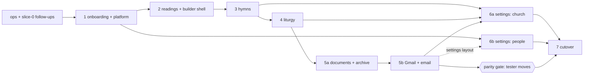

# Migration Foundations — Cross-cutting Design for Slices ops–7

**Date:** 2026-09-25
**Status:** Draft for review. Amended 2026-09-25 with the cross-slice consistency resolutions (see "Amendments from slice specs"). Amended 2026-09-26 for the service rubric (PR #4), the prayer library (PR #7) and the service reviewer (PR #8).
**Inputs:**
- Slice 0 spec: `docs/superpowers/specs/2026-09-25-react-fastapi-migration-design.md`
- Migration inventory: `docs/superpowers/specs/2026-09-25-streamlit-migration-inventory.md` (cited below as "inventory §n"). It is the source of truth for current behavior.
- The owner's product decisions 1-9 (restated where they shape a foundation).
- *Amendment 2026-09-26:* `2026-09-25-service-rubric-design.md` (PR #4, merged: current behavior on `main`), `2026-09-26-prayer-library-design.md` (PR #7) and `2026-09-26-service-reviewer-design.md` (PR #8). The last two are new-app only, built inside slices 4 and 6a and the reviewer add-on after 4b.

## Goal

Decide once the conventions, structure and shared machinery that every remaining slice builds on, so that slice specs cover only their feature. After this document, a slice author should not have to choose:
- an API shape, error code, timeout or guard;
- where a module goes, or how a module leaves Streamlit behind;
- how a schema change ships;
- how the frontend fetches, caches, stores a draft, lays out a builder step, confirms, or shows errors;
- how to test any of the above;
- how their slice interacts with the still-running Streamlit app.

Non-goals: feature behavior inside a slice (for example the hymn-matching algorithm), visual design beyond layout rules, and any hosting change.

---

## Decisions (summary)

| # | Topic | Decision | Rationale |
|---|---|---|---|
| D1 | Supabase Data API | **Lock it down first, in the ops slice.** Remove `public` from the Data API, enable RLS on every table, and revoke table grants from `anon` and `authenticated`. | Slice 0 put the anon key in the public frontend bundle. Supabase grants `anon` access to `public` tables by default, and tables created from SQLAlchemy have RLS off. Unless someone already locked this down, users, contacts and plaintext Gmail refresh tokens can be read over `/rest/v1` with that key. Verify this on day one (§3.6). |
| D2 | Streamlit freeze mechanism | **Production Streamlit runs from a `streamlit-frozen` branch.** `main` evolves freely. | Otherwise every backend refactor on `main` would redeploy into the live Streamlit app and could break the tester's weekly workflow. With a frozen branch, the database is the only contract between the two apps. |
| D3 | API versioning | No `/v1` prefix. The contract is guarded by a committed OpenAPI snapshot and TypeScript types generated from it. | There is one client, deployed together with the API. The snapshot catches drift between slices built by different authors. |
| D4 | Long-running endpoints | Synchronous `def` routes with explicit upstream timeouts, bounded concurrency and per-endpoint client timeouts. No job queue, no SSE, no websockets. | One tester, one always-on uvicorn worker, and the browser calls Railway directly (inventory §2.3). |
| D5 | Transactions and errors | A new `backend/usecases/` package owns orchestration and transactions and raises typed `DomainError`s. Routes stay thin. Nothing under `usecases/` imports FastAPI. | This removes the non-atomic multi-step writes and the UI-shaped error handling listed in inventory §3 and §4. |
| D6 | Migrations | Alembic in `backend/migrations/`. Existing production is stamped at the baseline, never re-created. Railway runs `alembic upgrade head` as a pre-deploy command. Changes are expand-only until slice 7. | `create_all` cannot alter tables. The frozen Streamlit app keeps reading the same tables. |
| D7 | Server state (frontend) | **TanStack Query v5.** | About 15 church-scoped resources need cross-screen invalidation (for example Settings hymn edits must refresh the builder), StrictMode request dedupe, a clean reset on church switch and logout, and a retry policy. A hand-rolled cache would re-implement most of that. |
| D8 | Draft persistence | A hand-rolled, versioned, zod-validated store in localStorage under key `wsb:draft:{userId}:{churchId}`. It is not part of the query cache. | Owner decision 1. A per-church key with explicit migration is simpler hand-rolled than bent into a persistence middleware. |
| D9 | Builder navigation | Each step is its own URL (`/builder/readings`, `/hymns`, `/liturgy`, `/review`). Steps are never gated. Completeness is shown as status, and only Save, Download and Email require a valid date. | Refresh and the back button work. Editing an archived service needs free movement between steps. |
| D10 | Component testing | Vitest with two projects: `unit` (node, `*.test.ts`) and `dom` (jsdom, `*.test.tsx`), plus Testing Library. The network is faked by stubbing `fetch`. No MSW. | `apiFetch` is the only network path, so a fetch stub is enough and avoids known jsdom/MSW friction. |
| D11 | Browser E2E | **No Playwright** during the migration. Every slice ends with a manual smoke checklist at 375 px and on desktop. | With Google-only sign-in, E2E would need either an auth bypass in a public repo or a local Supabase with a provider the backend rejects on purpose. Neither is worth it for one tester. |
| D12 | Identity writes | `INSERT … ON CONFLICT (email) DO NOTHING`, then select. A 5-minute in-process user cache. `last_login_at` is written at most hourly. | Fixes the first-request 500 and stops every API call being a write (deferred slice-0 issues). |
| D13 | Unexpected errors | A pure-ASGI catch-all middleware installed *inside* CORS, plus a request id on every response and error body. | Browsers currently see 500s as network errors (deferred slice-0 issue). |
| D14 | Invite links | The frontend builds `https://<origin>/join?code=…` itself. `/join` is a public route that keeps the code in sessionStorage across sign-in. Whether joining then needs an explicit **Join** tap awaits owner sign-off (§4.3). | Works on localhost and in production with no backend config (owner decision 6). |
| D15 | Slice order | ops → 1 → 2 → 3 → 4 → 5a → 5b → (tester moves) → 6a → 6b → 7. 6b may run in parallel any time after 1. | This is the inventory §5 order. Two changes: the three deferred slice-0 backend fixes move from 1 into ops, and slice 1 also carries the platform foundations (§7). |

---

## Amendments from slice specs

The slice specs refined several foundation rules. This pass folds every one of them back into this document **before implementation**, so no rule depends on merge order. The sections named below already state the amended rule; this table is the index. A slice spec that disagrees with a rule here is wrong and gets fixed to match.

| Section | Amendment | Source |
|---|---|---|
| §1.2 | `PUBLIC` also allowlists FastAPI's own `/openapi.json`, `/docs`, `/docs/oauth2-redirect` and `/redoc`. | 1 |
| §1.3 | `HymnRef`, `SlotHymns` and `SectionKey` are frozen here, one definition. Slice 3 creates them; 4 and 5a import them unchanged. `hymnal` has no pattern and `title` is ≤300. | 3, 4, 5a (resolution) |
| §1.5 | New code `db_unavailable` (503), including the readiness gate's `details.reason = "schema_behind"`. `require_church` 403s carry `details.reason = "no_church_access"`. On `POST /liturgy/generate`, AI and prompt codes come back per section inside a 200. 429 is `domain_errors.RateLimited`, always with `details.retry_after_seconds`. | ops, 1, 4, resolution |
| §1.6 | One key rule for every client: reuse a key only for an identical retry after an uncertain outcome; rotate after any 2xx or 4xx and whenever the body changes. The server never stores `RateLimited`, and a route may store selected 5xx (5b's uncertain sends). | 1, 5a, 5b |
| §1.8 | New `lectionary` bucket. `scripture` is charged per upstream part. `church_create` becomes a 3-per-minute burst guard that cannot pre-empt slice 1's durable 5-per-24 h cap. `ai` is charged per AI section on `/liturgy/generate`; `email` is charged only right before Gmail. The limiter raises `RateLimited`. | 1, 2, 4, 5b (resolution) |
| §2.2 | `RateLimited` joins the `DomainError` table. `ApiError` gains no `headers`. | 1, 2 (resolution) |
| §2.5 | `GZipMiddleware` is the innermost middleware. | 3 |
| §2.6, §3.3 | The Railway health check is `/health/ready`, which in production returns 503 when the schema is behind head. `/health` stays the dependency-free liveness probe. | 1, ops (resolution) |
| §2.8 | The OpenAI client retries on its own (SDK `max_retries=0`, backoff ≤2 s), accepts an optional `deadline`, and maps `insufficient_quota` to `ai_not_configured` without retrying. | 3 |
| §3.5 | Revision chain: `0005_services_extras` (plus `ix_services_church_date`), `0006_invites_integrity` (6b-1), then `memberships_one_owner` (6b-2), then slice 7's `normalize_legacy_data`, `contract_after_cutover` and `encrypt_gmail_tokens`. File numbers follow merge order. | 5a, 6b, 7 (resolution) |
| §4.3 | Preview-then-**Join** on `/join` is **pending owner sign-off before 1b** because it departs from decision 6's wording. The auto-accept fallback is specified. | 1 (resolution) |
| §4.4 | Hymn and hymnal mutations also invalidate `profile`. Service save and delete also invalidate `hymns`. `PATCH /church` with `default_hymnal` also invalidates `hymnals`. New key `hymnal-sources`. Role 403s don't trigger the church fallback. | 3, 5a, 6a, 6b |
| §4.6 | `editing` gains `date_iso`, and the draft gains `save_key_fingerprint` (a `DRAFT_VERSION` bump with a migration). | 5a |
| §7.2 | The Combobox pattern moves from slice 3 to slice 1 (`TimezoneCombobox`). | 1, 3, 6a (resolution) |
| §1.1 | *(2026-09-26)* `GET`/`PATCH /rubric` (PR #4, already on `main`) keep their top-level path, the one exception to "church sub-resources sit under `/church`". New: `/church/prayer-library` (+ `/voice-profile-draft`) and the reviewer actions `POST /liturgy/review` and `POST /liturgy/revise`. | PR #4, PR #7, PR #8 |
| §1.3 | *(2026-09-26)* `PATCH /rubric` takes a plain JSON object checked by `service_rubric.validate_patch`, which rejects unknown keys itself, as a declared exception to the model rule. `SermonText {ref ≤200, text ≤20 000}` is shared by `/liturgy/generate`, `/liturgy/review` and `/liturgy/revise`. | PR #4, 4, PR #8 |
| §1.5 | *(2026-09-26)* New 422 code `invalid_rubric` (PR #4's `PATCH /rubric`). `POST /liturgy/review` returns AI failures and an empty `ai` bucket as `ai_status` inside a 200, like `/liturgy/generate`; `ai_status` is a field, not an error code. | PR #4, PR #8 |
| §1.7 | *(2026-09-26)* Since PR #4, `repos.churches._merge_settings` (and so frozen Streamlit's settings writes) locks the church row. | PR #4 |
| §1.8 | *(2026-09-26)* `ai` bucket: `POST /church/prayer-library/voice-profile-draft` and `POST /liturgy/revise` (dependency, cost 1), and `POST /liturgy/review` (cost 1, only when the AI runs; empty bucket → `ai_status: rate_limited`). Timeout rows added. `POST /liturgy/review` is the second exception to the 504 timeout rule: AI failures come back as `ai_status` inside a 200. | PR #7, PR #8 |
| §2.8 | *(2026-09-26)* The prompt-size cap: the voice-profile draft never returns it (it cuts each prayer to fit, 6a), and `POST /liturgy/revise` drops the profile, the sermon text and the checklist before returning 422 `prompt_invalid` "This prayer is too long to revise." (slice 4). | 6a, 4, PR #7, PR #8 |
| §3.2 | *(2026-09-26)* `0001_baseline` includes `text_year` and `hymnal_count` on `hymns` and `hymn_catalog` (already in production), `0002_reconcile` adds them where missing, and `migrate_add_hymn_facts.py` is deleted with `migrate_add_hymnal.py`. | PR #4, 1 |
| §3.5 | *(2026-09-26)* Settings keys `rubric` (PR #4; read in 3, 4 and frozen Streamlit; written by `PATCH /rubric`, edited in 6a) and `prayer_library` (PR #7; read in 4, written in 6a). No DDL. | PR #4, PR #7 |
| §4.1, §4.4 | *(2026-09-26)* Routes `/settings/prayers` and `/settings/rubric`; keys `rubric` and `prayer-library`; a rubric save with `prefer_before_year` also invalidates `hymns`. | 6a |
| §6.2 | *(2026-09-26)* Frozen Streamlit (cut after PR #4) reads `settings.rubric` and maps `text_year`/`hymnal_count`. It keeps the old season wording; under the §6.1 item 6 contingency, slice 4's `generate_liturgy` wrapper keeps it through a frozen copy of the old constant (`liturgy_prompts.LEGACY_SYSTEM_PROMPT`), and Streamlit's Settings page shows and compares with the same copy (`legacy_default_prompts()`), so the new season guidance reaches only the new app. | PR #4, PR #8, 4 |

---

## 1. API conventions

These rules apply to every route added from the ops slice on.

### 1.1 Paths and resources

- Paths use kebab-case, plural nouns and no trailing slash. Set `FastAPI(redirect_slashes=False)`: a 307 redirect across origins would drop the `Authorization` header.
- **Church-scoped collections** are top-level: `/hymns`, `/hymnals`, `/services`, `/contacts`, `/members`, `/invites`. The church comes only from `X-Church-Id` (§1.2).
- **The active church** is the singleton `/church`. Its sub-resources and actions sit under it: `/church/liturgy-prompts`, `/church/transfer-ownership`, `/church/leave`.
- **User-scoped and global reference routes** carry no church:
  - `/me`, `POST /churches`, `/invites/accept`, `/invites/preview`
  - `/lectionary/readings`, `/translations`, `/scripture/passages`, `/liturgy/config`
  - `/gmail-connection`
- **Actions** that are not CRUD are POST to a noun: `POST /hymns/suggestions`, `POST /liturgy/generate`, `POST /documents`, `POST /bulletin-emails`.
- **Methods:**
  - GET reads.
  - POST creates, or runs an action.
  - PUT fully replaces (`/services/{id}`, `/church/liturgy-prompts`).
  - PATCH partially updates (`/church`, `/hymns/{id}`, `/members/{user_id}`).
  - DELETE returns **200 with a small JSON body**, for example `{"deleted": true}`, because `apiFetch` parses JSON on success.
- Path ids are typed `uuid.UUID`, so a malformed id becomes a 422, not a 500.
- Secrets never go in a path or query string. Invite codes and OAuth code/state travel only in POST bodies.
- The endpoint list in inventory §2.2 is adopted, with these amendments:
  - `GET /invites` and `POST /invites` return no `url`; the frontend builds the link (D14).
  - `POST /church/leave` is added (6b).
  - Invites gain a `reusable` flag (6b; the column lands in 1).
  - `/documents/preview` and `/hymns/suggestions/stream` are dropped (D4).
  - *Amendment 2026-09-26:* `GET /rubric` (church) and `PATCH /rubric` (admin) already exist from PR #4 and **keep their path**. They are the one exception to the `/church/…` rule for settings sub-resources, and no new route follows them. New routes: `GET`/`PUT /church/prayer-library` and the action `POST /church/prayer-library/voice-profile-draft` (6a, PR #7); the actions `POST /liturgy/review` and `POST /liturgy/revise` (the reviewer add-on after 4b, PR #8).

### 1.2 Scoping and guards

| Guard | Dependency (backend/api/deps.py) | Meaning |
|---|---|---|
| public | none | `/health`, `/health/ready`, and FastAPI's built-in `/openapi.json`, `/docs`, `/docs/oauth2-redirect` and `/redoc` (slice 1). The docs routes serve only the schema, which is already public in the repo (`openapi.json`, §1.11), and never data. |
| user | `get_current_user` | Signed in with Google. `X-Church-Id` is ignored even if sent. |
| church | `require_church` | Member (any role) of the church in `X-Church-Id`. It is re-validated on every request with `tenancy.validate_active_church`. |
| admin | `require_admin` | Owner or admin. Depends on `require_church`. |
| owner | `require_owner` (**new, built in 6b**) | `role == "owner"`, else 403 `forbidden` "Only the owner can do that." Depends on `require_church`. |

Rules:
1. Every church-scoped route depends on `require_church`, directly or through `require_admin`/`require_owner`. Repo and usecase calls receive **only** `ActiveChurch.id`.
2. A resource id from the path or body is always looked up *with* the church (`WHERE id = :id AND church_id = :church`). An id from another church returns **404**, never 403, so the API does not reveal that the resource exists.
3. Rules finer than the role (owner protection, self-changes, last admin) live in `usecases/` as pure, table-tested functions and raise `Forbidden` or `Conflict`.
4. A guard test, `backend/tests/test_route_guards.py` (built in slice 1), walks `app.routes`:
   - It asserts that every route outside an explicit `PUBLIC` or `USER_SCOPED` allowlist has `require_church` in its dependency tree. `PUBLIC` is exactly the public row above.
   - Every slice that adds a user-scoped route adds it to the allowlist in the same PR.
5. Every church-scoped route gets a cross-church isolation test using the shared helper `assert_church_isolated(...)` (slice 1, `backend/tests/api_helpers.py`). The helper checks two things:
   - a non-member gets 403;
   - a member of church A acting on a resource of church B gets 404.

### 1.3 Bodies

- **JSON field names are `snake_case` end to end.** Frontend API types are generated in snake_case (§1.11). There is no case-conversion layer.
- **Dates** are `YYYY-MM-DD` strings. **Timestamps** are ISO 8601 with offset. **Ids** are UUID strings.
- **Request models:**
  - Pydantic v2 with `ConfigDict(extra="forbid")`, so unknown fields are rejected and client drift surfaces early.
  - Pydantic enforces **types, enums and maximum sizes only** (string `max_length`, list `max_length`).
  - Human-facing rules (required after trimming, IANA timezone, name confirmation, email format messages) live in usecases, with the exact user-facing messages from the inventory. Do not add `min_length=1` to a field that has a friendly "X is required." message; the generic 422 would fire first.
- **Response models:** every route declares `response_model`, which the OpenAPI contract needs. A single resource is returned bare. A list is always an object, `{"items": [...]}`, never a bare array.
- **Shared schemas:**
  - A model used by two or more route modules lives in `backend/api/schemas.py`, for example `ServiceDraft`, `HymnRef`, `Page`.
  - A model used by one route module sits at the top of that module.
  - `ServiceDraft` is the shape in inventory §2.1 plus `hymnal: str | null`.
  - *Amendment 2026-09-26:* `SermonText {ref: str ≤200, text: str ≤20 000}` (`extra="forbid"`) lives in `api/schemas.py`, shared by `POST /liturgy/generate` (slice 4), `/liturgy/review` and `/liturgy/revise` (PR #8).
- *Amendment 2026-09-26, declared exception:* `PATCH /rubric` (PR #4) takes a plain JSON object validated by `service_rubric.validate_patch`, not a Pydantic model. The validator rejects unknown keys and bad values itself with 422 `invalid_rubric` and a readable message, so the intent of `extra="forbid"` holds.
- **`HymnRef`, `SlotHymns` and `SectionKey` are frozen here.** This is the only definition. Slice 3 lands first and creates them in `backend/api/schemas.py` with exactly this shape, although no slice-3 route uses them. Slice 4 (`POST /liturgy/generate`) and 5a (`ServiceDraft`, `/services`, `/documents`) and 5b (`/bulletin-emails`) import them unchanged and neither redefine, tighten nor loosen them. A change needs an amendment here first.

  ```python
  SectionKey = Literal["call_to_worship", "opening_prayer", "prayer_of_confession", "assurance",
                       "prayer_for_illumination", "prayers_of_the_people", "offertory_prayer", "benediction"]

  class HymnRef(BaseModel):
      model_config = ConfigDict(extra="forbid")
      hymn_id: uuid.UUID | None = None
      title: str = Field(default="", max_length=300)
      number: int | None = Field(default=None, ge=0, le=100_000)
      hymnal: str | None = Field(default=None, max_length=20)   # deliberately no pattern

  class SlotHymns(BaseModel):
      model_config = ConfigDict(extra="forbid")
      opening: HymnRef | None = None
      response: HymnRef | None = None
      closing: HymnRef | None = None
  ```

  - **No pattern on `HymnRef.hymnal`.** The value echoes `hymns.hymnal` from the database, and CLI-imported codes were never pattern-checked. A pattern would make a pick from such a hymnal fail with 422 on `/liturgy/generate`, `/services`, `/documents` and `/bulletin-emails`. Slice 3's `HymnalCode` type (`^[A-Za-z0-9_-]{2,20}$`) is used only on the query and path parameters that need it (for example `GET /hymns?hymnal=`), never inside `HymnRef`.
  - **`title` ≤300** everywhere, on the server and in every client-side cut. A 200-character limit anywhere would reject titles that another slice's client allows.
  - `hymn_id: null` is accepted only to carry an archived snapshot that no longer matches the hymnal. The UI can never create one (owner decision 9).
  - For any non-null `hymn_id`, the server resolves title, number and hymnal from the database, within the active church, and ignores the client's copy. So the limits above only bound the request size.

### 1.4 Pagination

- Offset pagination: `?limit=&offset=`. Default limit 50, maximum 200.
- The response is `{"items": [...], "total": n, "limit": l, "offset": o}`.
- Exception: `GET /hymns` allows `limit` up to 2000, because the builder picker loads one hymnal whole and filters on the client.
- Every paged endpoint documents a deterministic `ORDER BY` with an id tie-breaker. NULLs sort last explicitly (`nulls_last()`), so SQLite and Postgres return the same order.
- Small bounded lists (contacts, members, invites, hymnals) return `{"items": [...]}` without paging.

### 1.5 Errors

**Body** (extends slice 0 without breaking it):

```json
{"error": {"code": "invalid_request", "message": "Church name is required.",
           "request_id": "9f2c…", "fields": {"name": "Church name is required."},
           "details": {"disconnected": true}}}
```

`code`, `message` and `request_id` are always present. `fields` appears only for field-attributable 422s. `details` is an optional, code-specific object (for example `gmail_send_failed` → `{"disconnected": bool}`).

**Status and code registry.** The backend defines codes in one place, `domain_errors.ERROR_CODES` (slice 1), which `api/errors.py` also uses. The frontend mirrors them as a union type in `src/lib/api/errors.ts` (checked by `test_error_registry.py`, slice 1), and client logic switches on `code` and `details`, never on `message`.

| Status | Codes | When |
|---|---|---|
| 400 | `invite_rejected`, `gmail_state_invalid`, `gmail_connect_failed` | Well-formed request that the domain refuses |
| 401 | `unauthenticated` | Missing, invalid or expired token |
| 403 | `forbidden` | Not a member, wrong role, or an owner-protection rule (with a specific message). A `require_church` 403 (not a member of the church in `X-Church-Id`) carries `details.reason = "no_church_access"`; a role or policy 403 carries no `reason` (slice 1). The client's church fallback (§4.2) keys on that reason. |
| 404 | `not_found` | Unknown id, or an id from another church |
| 409 | `conflict` (stale write), `last_admin`, `owner_must_transfer`, `invite_exists`, `gmail_not_connected` | Conflicts with current state |
| 422 | `invalid_request`, `prompt_invalid`, `idempotency_mismatch`, `invalid_rubric` (*amendment 2026-09-26*: PR #4's `PATCH /rubric`; message from `service_rubric`, no `fields`) | Input the user can correct |
| 429 | `rate_limited` (+ `Retry-After` header and `details.retry_after_seconds`) | §1.8. Always raised as `domain_errors.RateLimited` (§2.2), by the limiter and by slice 1's durable church-create cap alike. |
| 500 | `internal_error` | Anything unexpected. The message is generic and the stack trace is logged. |
| 502 | `upstream_error`, `ai_upstream_error`, `gmail_send_failed` | Upstream returned an error |
| 503 | `auth_unavailable`, `ai_not_configured`, `ai_busy`, `gmail_not_configured` | Dependency not configured or saturated |
| 503 | `db_unavailable` (ops; in `ERROR_CODES` from slice 1) | Returned only by `GET /health/ready`: "The database is not reachable." (ops), or, in production, the schema-behind readiness gate "The database schema is behind this release." with `details: {"reason": "schema_behind", "current": X, "head": Y}` (slice 1, §2.6, §3.3). One code with a `details.reason` rather than a separate `schema_behind` code, because both mean "this release must not take traffic". The UI never calls `/health/ready`. |
| 504 | `upstream_timeout`, `ai_timeout` | Upstream timed out |

**Per-section AI results on `POST /liturgy/generate` (slice 4).** On that route only, `ai_not_configured`, `ai_busy`, `ai_timeout`, `ai_upstream_error` and `prompt_invalid` are not HTTP errors. They come back per section inside a **200** body as `SectionError {code, message}` with the same codes and messages, next to any override or generated text in the same response (owner decision 9 needs typed cards and "AI not configured" side by side). Hymn-resolution 404s, request-validation 422s and 429 stay HTTP errors on that route. `POST /hymns/suggestions` (slice 3) still returns the AI codes as HTTP statuses, so the frontend union keeps them.

**`POST /liturgy/review` (amendment 2026-09-26, PR #8).** On a valid request it always returns 200 with the code-check notes. AI failures (`not_configured`, `busy`, `timeout`, `error`) and an empty `ai` bucket (`rate_limited`) are reported in the body field `ai_status`, not as HTTP errors and not as `RateLimited`. `ai_status` values are not error codes and are not added to `ERROR_CODES`. `POST /liturgy/revise` and `POST /church/prayer-library/voice-profile-draft` return the AI codes as HTTP statuses, like `/hymns/suggestions`.

**Validation errors:**
- Pydantic `RequestValidationError` → 422 `invalid_request`, message "The request was not valid." `fields` maps dotted locations (`body.hymns.opening.title` → `hymns.opening.title`) to short messages: "Required.", "Too long (max N characters).", "Not a valid value.".
- Usecase `InvalidInput(field=…, message=…)` → 422 with that message as both `message` and `fields[field]`.

**Never leak upstream text.** OpenAI, Google and database error text is logged, never returned. Only messages defined in our code reach users. This replaces the `str(e)` pattern in inventory §4.

### 1.6 Idempotency

- Header `Idempotency-Key: <uuid v4>`. It is **required** on `POST /bulletin-emails` (422 if missing) and **accepted** on `POST /churches`, `POST /services` and `POST /invites`.
- Implementation: `backend/api/idempotency.py` (slice 1), `run_idempotent(...)`.
  - An in-memory store keyed by `(user_id, method, route template, key)` with a 15-minute TTL.
  - It stores status plus body for 2xx responses and for `DomainError` 4xx responses, **except `RateLimited`**: a 429 is never stored, so the same key can be retried after `Retry-After` (5b relies on this).
  - It stores no 5xx, and drops the entry and re-raises on any exception that is not a `DomainError`. **Exception (5b):** a route may pass `store_error: Callable[[DomainError], bool]`, and a 5xx `DomainError` for which it returns True is stored too. `POST /bulletin-emails` uses it for uncertain sends (`details.send_uncertain: true`), so a retry replays "check your Sent folder" instead of sending twice.
  - A replay returns the stored status and body with the header `Idempotent-Replayed: true` (slice 1).
  - A concurrent request with the same key waits on a per-key lock and receives the stored response.
  - The same key with a different body hash → 422 `idempotency_mismatch`.
  - This is acceptable because there is one uvicorn worker. If `--workers` ever exceeds 1, move the store to a Postgres table first.
- **Frontend key rule (one rule for every idempotent POST; slices 1, 5a, 5b).** Because the server stores 4xx answers and rejects a reused key with a different body, a key must never outlive a definitive answer:
  - **Reuse** the key only for a retry with an unchanged body after an uncertain outcome (`network_error`, `timeout`, `aborted`, or any 5xx), or while that request is still in flight (a double tap).
  - **Rotate** to a new key after any 2xx or any 4xx, and whenever the body changes. So a corrected resubmit after a 422 never replays the stored 422 or meets `idempotency_mismatch`.
  - Where each form keeps its key:
    - Create-church form: `createKeyTracker()` from `src/lib/idempotency.ts` (slice 1), one tracker per form mount.
    - New-service save: `draft.save_key` plus `draft.save_key_fingerprint` (§4.6), through the pure `src/lib/draft/save-key.ts` (5a). It is persisted in the draft, so it survives a refresh. A PUT never uses it; PUTs are naturally idempotent. On `idempotency_mismatch` the client retries once with the new key.
    - Email dialog: `createSendKeyTracker()` (5b), the same tracker keyed by the draft fingerprint. "Send again anyway" after an uncertain send rotates deliberately.
    - Invite create: a new key per click (6b).

### 1.7 Concurrency on writes

- `PUT /services/{id}` takes `If-Match: <saved_at>`. A mismatch → 409 `conflict` "This service was changed by someone else. Reload it to see their changes." The client offers "Reload" or "Save as new".
- Settings JSON writes (`churches.settings`) read-modify-write under `SELECT … FOR UPDATE` in one transaction (6a). Two things still happen outside a single transaction: the Streamlit app's own settings writes (frozen), and the SQLite dev path, where `FOR UPDATE` does nothing (a known SQLite gap, covered by the Postgres test job). *Amendment 2026-09-26:* PR #4 made `repos.churches._merge_settings` and `update_church_rubric` lock the church row (`_lock_live_church`). `streamlit-frozen` is cut after PR #4, so frozen Streamlit's settings writes are locked too; only its hymn, contact and profile-name writes remain unlocked. 6a renames that helper `lock_church` (one helper) and routes `PATCH /rubric` through `lock_and_read_actor`.

### 1.8 Long-running endpoints, timeouts and rate limits

**Policy (D4):**
- Routes that do blocking I/O are plain `def`, so they run in the threadpool.
- No database connection is held during an external call. A usecase reads, closes the session, calls out, then opens a new session to write.
- Fan-out happens on the client where the UI benefits: one liturgy section per request, and one scripture reference per request. Inside a request, bounded thread pools do the work.
- The client shows a spinner. After 8 s it adds "Still working — this can take up to a minute." AI calls also get a **Cancel** button, which aborts the client wait; the server finishes and discards the result.

| Endpoint | Server upstream limits | Server worst case | Client `timeoutMs` |
|---|---|---|---|
| Default (database only) | — | < 2 s | 20 000 |
| `POST /churches`, `POST /hymnals` | bulk insert | < 10 s | 30 000 |
| `GET /lectionary/readings` | Lectio 10 s and Vanderbilt 15 s (connect 5 s), **in parallel**. TTL cache: success 24 h, failure 5 min. | 15 s | 25 000 |
| `POST /scripture/passages` (UI sends one reference) | 10 s per part, ≤ 4 parts in parallel. Public-domain text cached 7 days; ESV never cached. | 20 s | 30 000 |
| `POST /hymns/suggestions` | NT text 10 s (skipped when `nt_text` is sent) + OpenAI (§2.8), all inside a 75 s server deadline passed to `complete(deadline=…)` (slice 3) | ~75 s | 90 000 |
| `POST /liturgy/generate` (UI sends one section) | OpenAI (§2.8) + ≤ 15 s waiting for a concurrency slot | ~80 s | 90 000 |
| `POST /church/prayer-library/voice-profile-draft` (6a, PR #7; *amendment 2026-09-26*) | OpenAI inside a 75 s deadline passed to `complete(deadline=…)` | ~75 s | 90 000 |
| `POST /liturgy/review` (PR #8; *amendment 2026-09-26*) | code checks + OpenAI inside a 75 s deadline | ~75 s | 90 000 |
| `POST /liturgy/revise` (PR #8; *amendment 2026-09-26*) | OpenAI (§2.8), as `/liturgy/generate` for one section | ~80 s | 90 000 |
| `POST /documents` | local python-docx | < 3 s | 30 000 |
| `POST /gmail-connection` | Google token 15 s + userinfo 15 s | 30 s | 40 000 |
| `POST /bulletin-emails` | token refresh 15 s + send 30 s | 45 s | 60 000 |

- An upstream timeout on the server → 504 `upstream_timeout` or `ai_timeout`. Exceptions: on `POST /liturgy/generate`, `ai_timeout` is a per-section result inside a 200 (§1.5, slice 4); on `POST /liturgy/review` (*amendment 2026-09-26*, PR #8), AI failures (not configured, busy, timeout, rate limited, error) come back as `ai_status` inside a 200, with the code notes (§1.5).
- A client timeout → `ApiError(0, "timeout", "This is taking too long. Try again.")`.
- The ops slice confirms that Railway's proxy request limit exceeds 120 s (Railway documentation or support; do not add a sleep endpoint).

**Rate limits.** `backend/api/ratelimit.py` (built in slice 2) holds in-memory token buckets keyed by `(bucket, scope_id)`:
- `consume(bucket, *, user_id, church_id=None, cost=1)` charges every rule of the bucket all-or-nothing. When a rule lacks tokens it charges nothing and raises **`domain_errors.RateLimited`** (§2.2), never `ApiError`.
- `rate_limit("<bucket>")` is a FastAPI dependency that calls `consume(..., cost=1)`. Routes whose cost depends on the request, or that should charge only work that reaches an upstream, call `consume` themselves (see the table).
- The church id for church rules comes from the resolved `require_church`, never from the raw header.

| Bucket | Limit | Routes and how they are charged |
|---|---|---|
| `lectionary` | 120 / 5 min / user | `/lectionary/readings`, dependency (slice 2; uncached dates call third parties) |
| `scripture` | 60 **upstream parts** / 5 min / user | `/scripture/passages`. The route calls `consume(cost=len(parts))` after validation (slice 2). |
| `ai` | 40 / 10 min / user **and** 400 / day / church | `/hymns/suggestions`, dependency (slice 3). `/liturgy/generate`: the usecase calls a `charge(n)` callback once, with `n` = sections that will actually call the AI, and never when `n` is 0 (slice 4). *Amendment 2026-09-26:* `/church/prayer-library/voice-profile-draft` (6a) and `/liturgy/revise` (PR #8): dependency, cost 1. `/liturgy/review` (PR #8): a `charge(1)` callback only when the AI call is made; if the bucket is empty, the usecase catches `RateLimited`, skips the AI and returns `ai_status: "rate_limited"` with the code notes (a declared deviation, §1.5). |
| `email` | 10 / hour / user | `/bulletin-emails`. Not a dependency: the usecase charges once, right before the first Google call, so rejected requests and replays cost nothing (5b). |
| `church_create` | **3 / minute / user (burst guard)** | `POST /churches`, dependency (added to the route in 2). |

**`church_create` is only a burst guard.** The real limit is slice 1's **durable per-user cap**: at most 5 churches created in 24 h (counted from the database, including soft-deleted churches), which returns 429 `rate_limited` "You've created 5 churches in the last 24 hours. Try again later." The dependency runs before validation and before idempotency replay, so 422s and replays also spend burst tokens. At 3 per minute (one token back every 20 s) it stops only scripted bursts: a person filling in the form by hand, including a corrected resubmit or a key-reuse retry, stays under it, so the 6th create in 24 h meets the cap message, not the generic limiter message. Slice 1's 6th-create test must keep seeing the cap message after slice 2 wires the bucket (tests that create more than 3 churches advance the limiter's test clock or reset it between creates).

Exceeding a bucket → 429 `rate_limited` with the `Retry-After` header (seconds) and `details.retry_after_seconds`. The limiter's message is "Too many requests. Try again in {n} seconds." (slice 2). The client shows the message and disables retry until `Retry-After` has elapsed.

### 1.9 File downloads

- `POST /documents` takes `{variant: "bulletin" | "pastor", service: ServiceDraft}` and returns the document bytes.
  - `Content-Type: application/vnd.openxmlformats-officedocument.wordprocessingml.document`
  - `Content-Disposition: attachment; filename="worship_October_04_2026.docx"; filename*=UTF-8''worship_October_04_2026.docx`
  - `Cache-Control: no-store`
- Documents are always built from the posted draft, never from stored bytes (owner decision 4). Error responses on this route are still JSON.
- The frontend calls `apiFetchBlob()` (§4.5), which returns `{blob, filename}`:
  - The filename comes from `Content-Disposition`, which requires the CORS exposure in §1.10.
  - If the header is missing, `docxFilename(variant, dateIso)` builds the same name. A shared fixture keeps the Python and TypeScript formatters identical.
  - The download uses an object URL plus `<a download>`, and the URL is revoked afterwards. iOS opens its share and preview sheet, which is acceptable.

### 1.10 CORS

```python
CORSMiddleware(
    allow_origins=settings.cors_origins,
    allow_methods=["GET", "POST", "PUT", "PATCH", "DELETE"],
    allow_headers=["Authorization", "Content-Type", "X-Church-Id", "Idempotency-Key", "If-Match", "X-Request-Id"],
    expose_headers=["Content-Disposition", "Retry-After", "X-Request-Id"],
    max_age=600,
)
```

Installed outermost, so that it wraps the catch-all error middleware (§2.5). `allow_credentials` stays off: the API uses bearer tokens, not cookies.

### 1.11 Contract and deploy compatibility

- `backend/scripts/export_openapi.py` writes `frontend/src/lib/api/openapi.json` from `create_app().openapi()`, with sorted keys.
- `backend/tests/test_openapi_contract.py` fails when the committed file differs from the live schema, and prints the command to regenerate it.
- The frontend script `gen:api` runs `openapi-typescript src/lib/api/openapi.json -o src/lib/api/schema.d.ts`. CI regenerates the file and fails on `git diff`. `src/lib/api/types.ts` re-exports friendly aliases (`type Church = components["schemas"]["ChurchOut"]`), and hand-written API types are removed as each area is touched.
- Railway and Vercel deploy independently on merge, so each PR's API change must be **additive**: new routes, new optional fields. The frontend tolerates a missing optional field. A breaking change takes three PRs: backend adds, frontend switches, backend removes. Alembic migrations follow the same rule (§3.4).

---

## 2. Backend structure

### 2.1 Layout

```
backend/
  api/
    main.py            create_app(): middleware order, routers, lifespan (§2.5–2.6)
    deps.py            get_current_user, require_church, require_admin, require_owner
    errors.py          ApiError, DomainError → HTTP mapping, uniform body, request_id
    middleware.py      RequestIdMiddleware, UnhandledErrorMiddleware (pure ASGI)
    idempotency.py     §1.6
    ratelimit.py       §1.8
    settings.py        all env config (§2.6, §2.8)
    schemas.py         shared Pydantic models (ServiceDraft, HymnRef, Page, …)
    routes/            one module per resource area:
                       health, me, churches, invites, reference, lectionary, scripture,
                       hymns, hymnals, liturgy, services, documents, contacts, gmail,
                       bulletin_emails, members, church_prompts
  usecases/            NEW: orchestration + transactions; no FastAPI imports
    onboarding.py (1)  lectionary.py (2)  passages.py (2)  hymns.py (3)  liturgy.py (4)
    archive.py (5a)    documents.py (5a)  email.py (5b)    church_admin.py (6a/6b)  members.py (6b)
  integrations/        NEW: outbound clients
    http.py (2)        shared httpx.Client, timeouts, User-Agent
    openai_client.py (3)
  domain_errors.py     DomainError hierarchy (slice 1)
  cache.py (2)         thread-safe TTLCache (separate success/failure TTLs)
  scripture_refs.py (2)  liturgy_config.py (4)  service_output.py (5a)  hymnal_sources.py (6a)
  seed/hymnals/PH1990.csv   bundled hymnals (moved from repo-root data/hymnals in 6a; Railway deploys only backend/)
  db/ engine.py models.py upsert.py(ops)
  migrations/          Alembic (env.py, versions/, README.md); alembic.ini beside it (slice 1)
  repos/  worship_service.py  vanderbilt_lectionary.py  scripture_fetcher.py  liturgy_prompts.py
  hymn_usage.py  service_archive.py  email_contacts.py  google_oauth.py  tenancy.py  auth.py
  scripts/             export_openapi.py, record_fixtures.py (manual; never in CI)
  tests/
```

The application-service package is called `usecases/`, not `services/`, because "service" already means a worship service (the `services` table and the `/services` route).

### 2.2 Layer rules

1. **Routes:**
   - parse the request (Pydantic);
   - apply guards and rate-limit dependencies;
   - call **one** usecase function;
   - return a response model.
   Routes contain no SQL, no `try/except` for domain errors, and no calls to external services.
2. **Usecases:**
   - take `church_id` and `user_id` as `uuid.UUID`;
   - own the transaction boundary: `with session_scope() as s:` around every write that must be atomic;
   - raise `DomainError` subclasses;
   - never import `fastapi` or `streamlit`.
3. **Repos and domain modules:**
   - A repo function that is new or changed gains `session: Session | None = None`. When it is None, the function opens its own scope, which keeps it backward compatible.
   - Usecases pass their session so a multi-step write is one transaction: create church plus seed; save service plus replace usage; profile plus translation; transfer ownership.
4. **Errors:** `domain_errors.py` defines `DomainError(message, *, code=None, field=None, details=None)` and these subclasses:

   | Subclass | Status | Default code |
   |---|---|---|
   | `InvalidInput` | 422 | `invalid_request` |
   | `NotFound` | 404 | `not_found` |
   | `Forbidden` | 403 | `forbidden` |
   | `Conflict` | 409 | `conflict` |
   | `Rejected` | 400 | set per case |
   | `NotConfigured` | 503 | set per case |
   | `Busy` | 503 | set per case |
   | `UpstreamError` | 502 | set per case |
   | `UpstreamTimeout` | 504 | set per case |
   | `RateLimited(message, *, retry_after_seconds)` | 429 | `rate_limited` |

   `RateLimited` is the **only** 429 mechanism (slice 1 builds it; slice 2's `ratelimit.consume` raises it; slice 1's durable church-create cap raises it). It always sets `details.retry_after_seconds`, and the handler adds the `Retry-After` header from it. `run_idempotent` never stores it (§1.6).

   One exception handler in `api/errors.py` maps all of them to the body in §1.5. `ApiError` stays for API-layer failures only: authentication, plus the ops slice's recorded exception, `db_unavailable()` on the infrastructure probe `/health/ready`. `ApiError` gains `details` (slice 1) but no `headers`; nothing that needs a header raises it.
5. **Ids:** every public repo and usecase function coerces ids with one shared helper, `db.ids.as_uuid()`. It raises `NotFound` for malformed input instead of `ValueError` or `StatementError`. This fixes the inconsistent id handling in inventory §1 I.
6. Nothing under `backend/` imports `streamlit`. `test_no_streamlit_in_core.py` is extended in slice 1 to import `api.main` with every router mounted.

### 2.3 Refactoring domain modules out of Streamlit coupling

Because production Streamlit runs from `streamlit-frozen` (D2, §6), refactors on `main` need **no compatibility shims for `app.py` call sites**. Per slice, in order:

1. **Characterize first.** Before changing a domain function, write tests that pin its current behavior, with the network stubbed (§5.3). Then refactor. The one exception is a behavior the owner decided to change (for example any-date lectionary lookup, or the Psalm-as-NT fix): add the new test first and let it fail.
2. **Move logic out of `app.py`** into the modules named in inventory §3:

   | Destination | What moves | Slice |
   |---|---|---|
   | `scripture_refs.py` | OT/NT classifier | 2 |
   | `usecases/lectionary.py` | lectionary orchestration | 2 |
   | `liturgy_config.py` | section list, custom placements, communion text, first-Sunday rule | 4 |
   | `service_output.py` | `safe_date` and filename, variant flags, slot mapping, bulletin email composition | 5a |
   | `usecases/church_admin.py` | permission helpers and validation from `streamlit_views/settings.py` | 6a/6b |

   Do not re-export these from Streamlit modules.
3. **Replace UI-shaped returns with typed results.** For example: `accept_invite` returns `{ok, reason_code, message, church_id}`; suggestion and generation return structured per-slot or per-section results plus typed exceptions instead of placeholder text; the `[Could not load text]` sentinel becomes `None`.
4. **Replace process-global caches** (Vanderbilt `_cache`, the audio cache) with `cache.TTLCache`, or delete them (the audio cache goes in 3).
5. **Configuration:**
   - Configuration comes from `api/settings.py` (or `integrations/*` for clients) and is passed in. Domain modules stop calling `os.getenv` at call time and stop calling `load_dotenv()` at import; remove each one when its module is touched, and finish in 7.
   - `load_dotenv()` runs only in entry points: `api/main.py` and the CLIs.
6. **HTTP:** new and refactored outbound HTTP uses `integrations/http.py` (httpx). `requests` is removed in 7 if nothing uses it by then.
7. **If a refactor breaks a `streamlit_tests/` test on `main`:** port the assertion to a backend or API test and delete the Streamlit test in the same PR. Never edit frozen Streamlit code on `main` to make it pass.

### 2.4 Identity: upsert race fix and fewer per-request writes (ops slice)

New `repos.users.ensure_user(email, name, picture) -> UserRow`, in one transaction:
1. `INSERT INTO users (id, email, name, picture, created_at, last_login_at) VALUES (…) ON CONFLICT (email) DO NOTHING`.
   - This uses `db/upsert.py::insert_ignore(table)`, which picks `sqlalchemy.dialects.postgresql.insert` or `sqlite.insert` from `engine.dialect.name`. Both support `on_conflict_do_nothing`.
2. `SELECT id, name, picture, last_login_at FROM users WHERE email = :email`.
3. `UPDATE` only when:
   - a **truthy** incoming name or picture differs from the stored value (keeps the "overwrite only when truthy" rule of `upsert_from_claims`); or
   - `last_login_at` is NULL or older than **1 hour**.

`get_current_user` puts a process cache in front of this:
- `TTLCache(maxsize=1024, ttl=300 s)` keyed by normalized email, holding `CurrentUser` plus the name and picture that were last written.
- On a hit where the profile is unchanged, the request does **no** database work for identity.
- Result: a user causes at most one identity read per 5 minutes and one write per hour, and the concurrent first requests (StrictMode's double `/me`) both succeed.
- `last_login_at` now means "last seen, to the hour"; document this in `models.py`.
- `auth.upsert_from_claims` becomes a thin wrapper over `ensure_user`, keeping its tests. `repos.users.upsert_user` is folded into `ensure_user`.

`require_church` still runs `validate_active_church` on every request. That check is a security invariant and is never cached.

### 2.5 Unexpected errors, request ids, logging (ops slice)

- **`RequestIdMiddleware`** (pure ASGI):
  - accepts an inbound `X-Request-Id` if it matches `^[A-Za-z0-9-]{8,64}$`, else generates a uuid4 hex;
  - stores it in a contextvar;
  - sets the `X-Request-Id` response header.
  A logging filter adds `request_id=` to every log line.
- **`UnhandledErrorMiddleware`** (pure ASGI, not `BaseHTTPMiddleware`):
  - wraps `send` to track whether the response has started;
  - on an exception, logs `logger.exception(...)` with method, path and request id;
  - if the response has not started, sends the 500 `internal_error` JSON body with `request_id`; otherwise re-raises.
- **Order in `create_app`.** Starlette makes the *last added* middleware the outermost. Add them in this order:
  1. `GZipMiddleware(minimum_size=1024)` (slice 3), so it is innermost
  2. `UnhandledErrorMiddleware`
  3. `RequestIdMiddleware`
  4. `CORSMiddleware`

  CORS then wraps the catch-all and decorates its 500. The existing `@app.exception_handler(Exception)` stays as a last resort. GZip exists because `GET /hymns?limit=2000` for one hymnal is about 200 KB of JSON (about 35 KB gzipped). Until slice 3, the stack is the last three only. Slice 3 updates the ops middleware-order test in the same PR, to CORS, RequestId, UnhandledError, GZip (outermost first).
- **Test:** `TestClient(app, raise_server_exceptions=False)`, a route that raises, and an `Origin` header from `CORS_ORIGINS`. Assert the response is 500 with the uniform body, `access-control-allow-origin` and `x-request-id`.
- The frontend shows 500s as "Something went wrong. (Ref: {first 8 chars of request_id})".
- **Logging rules:**
  - One line per event: `name level request_id message`.
  - Never log request bodies, tokens, invite codes, OAuth code or state, email bodies, or AI prompts and outputs. Prompts are allowed at DEBUG only.
  - Log counts, ids, durations and outcome codes.

### 2.6 Startup: dialect logging, production guards, pool (ops slice; revision check in 1)

The lifespan does the following:
1. **Log the database target without secrets:** `Database: dialect=postgresql driver=psycopg2 host=aws-0-….pooler.supabase.com database=postgres`, built from `engine.url` fields. The username and password are never printed.
2. **Production guard.** New setting `APP_ENV` (`development` default, `production` on Railway). In production:
   - refuse to start (raise) if the dialect is not `postgresql`, which stops a missing `DATABASE_URL` from silently using an ephemeral SQLite file;
   - log an ERROR if `CORS_ORIGINS` contains only localhost.
   `SUPABASE_URL` keeps its slice-0 behavior: a warning plus 503s.
3. **Schema revision check** (slice 1). Compare the Alembic `current` revision with `head` (`db/schema_check.revision_state` → `current`, `behind` or `ahead`, stored in `app.state.schema_state`). If they differ, log WARNING `schema revision X != head Y`; in production, `behind` is logged at ERROR. Never auto-migrate at startup; Railway's pre-deploy command owns that (§3.3).
   - **Readiness gate** (slice 1): with `APP_ENV=production` and a `behind` schema, `/health/ready` returns 503 `db_unavailable` with `details.reason = "schema_behind"` (§1.5), so the Railway deploy health check (§3.3) fails and the previous release keeps serving. `ahead` returns 200, because expand-only migrations keep an older release working and a Railway rollback must never be blocked. A failed check (`unknown`) also returns 200, with its ERROR logged. Outside production the gate does nothing.
4. **RLS check** (Postgres only, slice 1). Log WARNING naming any `public` table with `rowsecurity = false` (§3.6).
5. **No `create_all` at startup.** Schema is Alembic's job (§3.3). Tests keep `create_all` in fixtures.
6. **Pool:** Postgres engine with `pool_size=5`, `max_overflow=5`, `pool_pre_ping`, `pool_recycle=1800`, all overridable through `DB_POOL_SIZE` / `DB_MAX_OVERFLOW`. The frozen Streamlit app keeps its own pool. The identity cache (§2.4) cuts per-request checkouts from at least 2 to about 1.

### 2.7 External calls and caches

- `integrations/http.py` (slice 2) provides one module-level `httpx.Client`:
  - `timeout=httpx.Timeout(read, connect=5.0)`, with the read value set per call from the table in §1.8;
  - `follow_redirects=True`;
  - `User-Agent: WorshipServiceBuilder/1.0`;
  - redirects allowed only to https.
  Parallel upstream calls use a `ThreadPoolExecutor(max_workers=4)` owned by the usecase.
- `cache.TTLCache(maxsize, ttl_ok, ttl_fail)` is thread-safe (a lock) and has separate TTLs for successes and failures. Never cache an error as an empty success.
- **ESV:** no server cache (Crossway terms). Public-domain translations: 7 days. Lectionary: 24 h for success, 5 min for failure.

### 2.8 OpenAI client (slice 3; reused in 4)

`backend/integrations/openai_client.py` is the only place that constructs an OpenAI client.

| Setting | Default | Notes |
|---|---|---|
| `OPENAI_API_KEY` | — | Stripped. A non-ASCII key counts as *not configured*: log ERROR once and never show config detail to members. |
| `OPENAI_MODEL` | **none** | Required when a key is set; otherwise AI is not configured and a startup warning is logged. Slice 3 sets a current, inexpensive chat model on Railway and records it in `.env.example`. This removes the stale `gpt-3.5-turbo` code default. |
| `OPENAI_TIMEOUT_SECONDS` | 30 | `httpx.Timeout(30, connect=5)` per attempt |
| `OPENAI_MAX_RETRIES` | 1 | Retries done by `complete()` itself, not the SDK (see "Retries") |
| `OPENAI_MAX_CONCURRENCY` | 4 | Process-wide semaphore. Waiting longer than 15 s (or the deadline rule below) → `Busy("ai_busy")` 503. |
| `OPENAI_TEMPERATURE` | unset | Sent only when set; reasoning models reject a non-default temperature |

**API:**
- `ai_available() -> bool`
- `complete(messages, *, max_completion_tokens: int, json_mode: bool = False, deadline: float | None = None) -> str`
  - Always sends `max_completion_tokens`, never `max_tokens`. Each caller sets it explicitly; it is never unbounded.
  - `json_mode` sets `response_format={"type": "json_object"}`, used by hymn suggestions.

**Retries (slice 3).** The SDK client is built with `max_retries=0`, because the SDK's own retry honors `Retry-After` for up to 60 s while holding a concurrency slot, which would break the 90 s client budget. `complete()` retries up to `OPENAI_MAX_RETRIES` times on `APIConnectionError` (including `APITimeoutError`), on `RateLimitError` other than `insufficient_quota`, and on `APIStatusError` with status ≥ 500. The wait before a retry is `min(Retry-After or 1 s, 2 s)`, through an injectable `sleep`.

**Deadline (slice 3).** `deadline` is a `time.monotonic()` instant.
- With a deadline: the semaphore wait is `min(15 s, remaining − 5 s)`; each attempt's timeout is `min(OPENAI_TIMEOUT_SECONDS, remaining)`; a retry starts only when at least 5 s remain after the backoff, otherwise the last error is mapped as usual. `POST /hymns/suggestions` passes a 75 s deadline (§1.8).
- Without a deadline: the limits in the table apply unchanged (15 s semaphore wait, `OPENAI_TIMEOUT_SECONDS` per attempt), with the same 2 s backoff cap.

**Error mapping**, checked in this order (subclasses before their bases):

| SDK error | Maps to |
|---|---|
| `APITimeoutError` | `UpstreamTimeout("ai_timeout")` |
| `RateLimitError` with `code == "insufficient_quota"` (slice 3) | `NotConfigured("ai_not_configured")`, **not retried**, logged at ERROR. This is what the OpenAI monthly budget cap produces, so members see "not set up" rather than "busy". |
| other `RateLimitError` | `Busy("ai_busy")` "The AI service is busy. Try again in a minute." |
| `AuthenticationError`, `PermissionDeniedError` | `NotConfigured("ai_not_configured")` (log ERROR) |
| `BadRequestError`, `APIConnectionError`, other `APIStatusError` | `UpstreamError("ai_upstream_error")` |

On `POST /liturgy/generate` these errors reach the client as per-section results inside a 200, not as HTTP statuses (§1.5, slice 4). *Amendment 2026-09-26:* on `POST /liturgy/review` they reach it as `ai_status` inside a 200 (§1.5, PR #8).

- **Logs:** model, duration, token usage and outcome only.
- **Tests:** a `FakeAI` implementing `complete()`, installed with `set_ai_for_tests()`. No test reaches OpenAI.
- **Cost guards:**
  - Cap the prompt size at 24 000 characters (422 `prompt_invalid` "This prompt is too long."). On `POST /liturgy/generate` this is a section-level `prompt_invalid` with slice 4's unified message instead of an HTTP 422 (§1.5). *Amendment 2026-09-26:* the voice-profile draft never returns it: it cuts each prayer to an equal share so the prompt fits (6a, PR #7). `POST /liturgy/revise` drops the voice profile, then the sermon text, then the checklist, and returns this 422 with the message "This prayer is too long to revise." only when the draft and the fixed instructions alone are too long (slice 4, PR #8).
  - Build candidate hymn lists on the server from the church's hymnal; never accept one from the client.
- Owner decision 9: generating without a key is allowed. The usecase applies typed card text first and raises `NotConfigured` only per section that needs AI (slice 4).

---

## 3. Database migrations (Alembic)

### 3.1 Setup (slice 1)

- Add `alembic>=1.13` to `backend/requirements.txt`. `backend/alembic.ini` sets `script_location = migrations` and `prepend_sys_path = .`.
- The folder is named `migrations/`, not `alembic/`, so it never shadows the package.
- `migrations/env.py` does the following:
  - uses `target_metadata = db.models.Base.metadata`;
  - takes the URL from `db.engine._database_url()` passed through `_normalize_url`;
  - sets `render_as_batch=True` on SQLite, `compare_type=True` and `compare_server_default=False` (production has a `DEFAULT 'GG2013'` from `migrate_add_hymnal.py` that the models do not declare);
  - sets `include_object`, which ignores reflected tables that are not in our metadata (so Alembic never proposes dropping anything it doesn't own);
  - on Postgres, runs `SET lock_timeout = '5s'` and `SET statement_timeout = '60s'` first, so a migration never hangs behind a Streamlit connection.
- **Naming:** no retroactive naming convention, which would make autogenerate rename existing constraints. Every *new* constraint and index gets an explicit `name=` in both the model and the migration.
- Revisions are hand-reviewed autogenerate output. File names: `NNNN_short_slug.py`. **Every revision has a working `downgrade()`.**

### 3.2 Baseline of the existing schema (slice 1, no data touched)

1. **`0001_baseline`** creates all 11 current tables exactly as in `db/models.py`. It is used only for fresh databases (CI, new local dev). *Amendment 2026-09-26:* "current" means `main` after PR #4, so the baseline includes the nullable `text_year` and `hymnal_count` INTEGER columns on `hymns` and `hymn_catalog`. Production already has them (PR #4's one-off `migrate_add_hymn_facts.py` ran before merge), so stamping stays correct.
2. **Production is stamped, not migrated.** The one-time runbook, run by the owner from a laptop with the production `DATABASE_URL`, lives in `backend/migrations/README.md`:
   1. `pg_dump` a local backup.
   2. `alembic stamp 0001_baseline`.
   3. `alembic check`, and record its output in the PR.
3. **`0002_reconcile`** contains only idempotent operations that make production equal the models:
   - `op.create_index("ix_hymns_church_hymnal", …, if_not_exists=True)` (the index `migrate_add_hymnal.py` never created);
   - any other difference `alembic check` reports, each written with `IF NOT EXISTS` guards;
   - *amendment 2026-09-26:* `text_year` and `hymnal_count` on `hymns` and `hymn_catalog`, added only where missing (`ADD COLUMN IF NOT EXISTS` on Postgres; an inspector check on SQLite). This is a no-op on production and fresh databases, and it repairs a local database created before PR #4 and then stamped.

   After it runs, `alembic check` must report no differences. `migrate_add_hymnal.py` is deleted in the same PR, and so is `migrate_add_hymn_facts.py` with its test (*amendment 2026-09-26*). `backfill_hymn_facts.py` (data, not schema) stays as an ops CLI.
4. **`0003_lockdown`** (Postgres only; no-op on SQLite):
   - `ALTER TABLE … ENABLE ROW LEVEL SECURITY` for every table, including `alembic_version`;
   - `REVOKE ALL ON ALL TABLES IN SCHEMA public FROM anon, authenticated`, plus the matching `ALTER DEFAULT PRIVILEGES`, inside `DO $$ … IF EXISTS (SELECT 1 FROM pg_roles WHERE rolname='anon') …$$`, so it runs on CI Postgres, where those roles don't exist.

   Codifies §3.6.
5. **`0004_invites_reusable`**:
   - `invites.reusable BOOLEAN NOT NULL DEFAULT false` (server default, so frozen-Streamlit inserts work);
   - `invites.accepted_by UUID NULL REFERENCES users(id) ON DELETE SET NULL`;
   - data step `UPDATE invites SET reusable = true WHERE email IS NULL`, so existing code-only invites keep their 7-day multi-use meaning.

   Slice 1's accept flow honors it: a non-reusable invite that is already accepted → "This invite has already been used."
6. **Local dev databases** that `create_all` made: run `alembic stamp 0001_baseline && alembic upgrade head` once. This is documented in the README in slice 1.

### 3.3 How migrations run

| Where | How |
|---|---|
| **Railway** | `backend/railway.toml` with `[deploy] preDeployCommand = ["alembic upgrade head"]` and `healthcheckPath = "/health/ready"` (slice 1). The start command stays in `Procfile`. Railway does not look for the file under the service root (`/backend`), so the service's Config-as-code path is set to `/backend/railway.toml` by hand (slice 1 runbook). A failed migration fails the deploy and the previous release keeps serving; expand-only migrations (§3.4) are what make that safe. **Schema-behind gate:** the deploy health check is `/health/ready`, not `/health`, so that a release that starts on a schema behind head (for example, the pre-deploy command was overridden) gets 503 `db_unavailable` with `details.reason = "schema_behind"` in production (§2.6), fails its health check and never goes live. `/health` stays the dependency-free liveness probe: it touches no database and is never used as the deploy check. |
| **CI, SQLite (every PR)** | `backend/tests/test_migrations.py`: `upgrade head` on an empty SQLite file, then `compare_metadata` against `Base.metadata` must be empty, then `downgrade base`, then `upgrade head`. Also asserts every revision file defines `downgrade`. |
| **CI, Postgres (every PR; new job in slice 1)** | Service container at the **same major version as the Supabase project** (slice 1 reads `SHOW server_version` and records it in `migrations/README.md`). Steps: `alembic upgrade head` → `alembic check` → `alembic downgrade base` → `alembic upgrade head` → `pytest -m postgres`. |
| **Tests** | Fixtures keep `create_all` for speed. `test_migrations.py` guarantees migrations and models agree. |
| **App startup** | Never migrates; it only logs a revision mismatch (§2.6). |

### 3.4 Rules while Streamlit still runs (until slice 7)

The frozen Streamlit app shares the database, and its ORM maps only the columns that existed at freeze time. A migration before slice 7 may:
- add a table;
- add a column that is **nullable or has a server default** (the ORM uses Python-side defaults, which frozen code won't supply);
- add an index;
- add a CHECK constraint, **only after** the migration first asserts that no existing row violates it (raise with a clear message) and that the frozen Streamlit UI cannot produce a violating value;
- relax or replace a constraint that Streamlit does not depend on for correctness.

It may **not**:
- drop or rename a column or table Streamlit reads or writes;
- change a column type;
- add NOT NULL without a server default;
- change the JSON shape Streamlit reads (§6.2).

Contract steps (drops, NOT NULL tightening, renames) wait for slice 7.

### 3.5 Planned schema changes by slice

**Chain rule.** Revision **names** are fixed; file **numbers follow merge order**. Every revision's `down_revision` is the Alembic head on `main` when its PR merges, never a hard-coded predecessor, and a PR that lands after a parallel one renumbers its file to the next free number during its rebase. `test_migrations.py` asserts a **single head** (slice 1; 5a or 6b adds the assertion if it is missing), so a wrong or duplicate `down_revision` fails CI. The numbers below are the expected order (5a before 6b-1); if 6b-1 merges first, it takes `0006` onto `0004` and 5a becomes `0007_services_extras` on top of it. Specs and tests refer to revisions after `0006` by name only.

| Slice (PR) | Revision | Change |
|---|---|---|
| 1 (1a) | `0001`–`0004` | §3.2 |
| 5a (5a-1) | `0005_services_extras` | `services.custom_elements JSON NULL`, `services.hymnal VARCHAR NULL` (owner decision 9), and the index `ix_services_church_date` on `services (church_id, service_date_iso)` for the archive list order and the usage rebuild. `update_service` writes the columns only when the caller passes them; frozen Streamlit never does. |
| 6b (6b-1) | `0006_invites_integrity` | Repair invite rows whose role is not member/admin (set `admin`, revoke), assert, then CHECK `ck_invites_role` `invites.role IN ('member','admin')`. Assert no duplicate pending email invites (runbook message), then replace `uq_invites_church_email` with the partial unique index `uq_invites_pending_email` `(church_id, lower(email)) WHERE email IS NOT NULL AND NOT revoked AND accepted_at IS NULL`. Expiry cannot sit in an index predicate, so the usecase revokes an expired invite before re-inviting the same email. |
| 6b (6b-2) | next free number, `memberships_one_owner` | Assert no church has two owners (runbook message, no automatic repair), then the partial unique index `uq_memberships_one_owner` on `memberships (church_id) WHERE role = 'owner'`. Ships with the 6b UI PR, not with 6b-1, because it breaks frozen Streamlit's transfer and there must be no stretch where transfer works in neither app. |
| 7 (7-C) | next free number, `normalize_legacy_data` | Data only, compatible with frozen Streamlit: normalize `{A,"B"}` theme literals and Notion-shaped `hymn_usage.date_iso` values (§6.4). May run during the quiet period. |
| 7 (7-G, after retirement) | next free number, `contract_after_cutover` | Contract phase: drop `users.google_sub` and the undeclared `'GG2013'` default on `hymnal`; `compare_server_default=True`. |
| 7 (7-G, after retirement) | next free number, `encrypt_gmail_tokens` | Gmail refresh-token encryption at rest (§6.4). |

When slice 7 starts, the head is always 6b-2's `memberships_one_owner`. 5a merges before 5b, 6b-2 merges after 5b, and 6a adds no revision. Slice 7's first revision takes the next free number on top of it.

`churches.settings` gains JSON keys `default_benediction` (read in 4 with fallback `"Halverson"`, written in 6a) and `default_hymnal` (read in 3, written in 6a). These are JSON keys, so no DDL is needed.

*Amendment 2026-09-26:* two more JSON keys, also with no DDL:
- `rubric`: PR #4's sparse overrides, already on `main`. It is read through `service_rubric.merge_rubric`, which ignores invalid values, by frozen Streamlit, slice 3 (suggestions and the `newer_than_preferred` flag) and slice 4 (checklists). It is written by `PATCH /rubric`, which 6a's editor uses and moves under `lock_and_read_actor`.
- `prayer_library`: PR #7's `{prayers, voice_profile}`. It is read in slice 4, where a missing or malformed value reads as empty, and by the reviewer add-on for the voice profile. It is written only by 6a's `PUT /church/prayer-library`. Frozen Streamlit ignores it.

### 3.6 Supabase Data API lockdown (ops slice, first task)

This is a manual step for the owner, codified later by `0003_lockdown`:
1. **Verify:**
   ```
   curl "https://<ref>.supabase.co/rest/v1/users?select=email&limit=1" \
     -H "apikey: <anon key>" -H "Authorization: Bearer <anon key>"
   ```
   Any rows mean the data is exposed now. Treat that as an incident: after the fix, rotate the Gmail refresh tokens by asking the tester to reconnect.
2. **Check that RLS won't block the apps.** Run:
   - `select tablename, tableowner from pg_tables where schemaname = 'public'`
   - `select rolbypassrls from pg_roles where rolname = current_user`

   The API and Streamlit connect as `postgres` through the pooler. Enabling RLS with no policies is safe only if `postgres` owns the tables or has BYPASSRLS. Record both results.
3. **Lock down:** in the Supabase dashboard, remove `public` from the Data API's exposed schemas, or turn the Data API off; the app never uses PostgREST. Then run the `0003_lockdown` SQL by hand.
4. **Confirm:**
   - the curl now fails;
   - `/me` works on the Vercel URL;
   - Streamlit loads the tester's church.

   **Rollback:** `ALTER TABLE … DISABLE ROW LEVEL SECURITY`.

---

## 4. Frontend architecture

Before writing Next.js code, read the relevant guide in `frontend/node_modules/next/dist/docs/` (frontend/AGENTS.md). Next 16 uses `proxy.ts`, not middleware. `useSearchParams` needs a Suspense boundary.

### 4.1 Route map

| Path | Group and guard | Purpose | Slice |
|---|---|---|---|
| `/login` | public | Google sign-in. Stores a validated `next` path (§4.3). | 0 (amended in 1) |
| `/auth/callback` | public (route handler) | Supabase code exchange, then redirect to `/` | 0 |
| `/join?code=…` | **public** | Keeps the invite code across sign-in, previews, accepts | 1 |
| `/welcome` (`?tab=join\|create`) | signed-in | Zero-church onboarding; also "Join or create a church" from the switcher | 1 |
| `/` | church | Redirects to `/builder` (placeholder cards until slice 2) | 1/2 |
| `/builder` | church | Redirects to the draft's `last_step` | 2 |
| `/builder/readings` | church | Step 1: date and readings | 2 |
| `/builder/hymns` | church | Step 2: hymns | 2 (shell), 3 |
| `/builder/liturgy` | church | Step 3: liturgy cards | 2 (shell), 4 |
| `/builder/review` | church | Step 4: review, save, download, email | 2 (shell), 5a, 5b |
| `/services` | church | Archive: paged list, load, delete (with confirmation) | 5a |
| `/settings` | church | Redirects to `/settings/church` | 5b |
| `/settings/account` | church | Signed-in identity, Gmail connection, log out | 5b |
| `/settings/church` | church (admin edits) | Name, timezone, default translation, default benediction, default hymnal | 6a |
| `/settings/hymns` | church (members edit hymns; admins add hymnals) | Hymn library, hymnals | 6a |
| `/settings/liturgy` | church (admin edits) | Liturgy prompts | 6a |
| `/settings/contacts` | church (admin edits) | Email contacts | 6a |
| `/settings/prayers` | church (admin edits) | Prayer library and voice profile (*amendment 2026-09-26*, PR #7). Nav order: right after Liturgy | 6a |
| `/settings/rubric` | church (admin edits) | Service rubric editor (*amendment 2026-09-26*, PR #4). Nav order: right after Prayers | 6a |
| `/settings/people` | church (admin manages; owner rules) | Members with emails, roles, invites | 6b |
| `/settings/danger` | church | Leave church (anyone), transfer ownership and delete church (owner) | 6b |
| `/gmail/callback` | signed-in | Gmail OAuth return. Handles `?error=`, POSTs `{code, state}`, returns to the stored path. | 5b |

**Folder layout:**

```
src/app/
  layout.tsx            root: <Providers> (QueryClientProvider, Toaster)
  login/  auth/callback/  join/
  (signed-in)/layout.tsx          requires session; loads /me
    welcome/  gmail/callback/
    (church)/layout.tsx           requires an active church; AppShell; ChurchProvider; keyed by church id
      page.tsx  builder/  services/  settings/
```

All data-fetching pages are client components. The API needs the browser's bearer token, so there is no server-side API fetching.

### 4.2 Layouts, guards and church context

- `proxy.ts` keeps refreshing the Supabase session. `PUBLIC_PATHS` becomes `/login`, `/auth/callback`, `/join`. When it redirects a signed-out visitor, it appends `?next=<pathname>` (path only, never the query) to `/login`.
- **`(signed-in)/layout.tsx`** runs `useMe()` (TanStack Query, key `["me"]`):
  - while loading → shell skeleton;
  - on 401 → sign out.
- **`(church)/layout.tsx`** resolves the active church:
  1. `pickActiveChurch(me.churches, readStoredChurchId())`, confirmed with `GET /church` (key `["church", id, "profile"]`).
  2. On a 403 with `details.reason = "no_church_access"` (§1.5) → toast "You no longer have access to {name}.", refetch `/me`, pick the next church. This fixes the slice-0 parity gap. A role or policy 403 (no `reason`) never triggers this fallback (§4.4).
  3. No churches → `router.replace("/welcome")`.
  4. It renders `<ChurchProvider value={church}><Fragment key={church.id}>{children}</Fragment></ChurchProvider>`. The **key remount** resets every church-scoped component (open dialogs, forms, local state) on switch.
- **Header (`AppHeader`):**
  - The church switcher becomes a `DropdownMenu` with a `DropdownMenuRadioGroup` of churches (keyed by id), a separator, and **"Join or create a church…"** → `/welcome` (owner decision 9). A user with one church sees the same menu.
  - The account menu holds name, email, role, "Settings" and "Log out".
  - Primary navigation (Builder, Services, Settings) is a header link row at `md` and wider, and a three-item segmented row under the header below `md`. The bottom of the screen belongs to the builder's step footer.
  - Each nav item appears only once its slice ships.
- **Sign out** (menu or any 401):
  1. `queryClient.clear()`
  2. `storeChurchId(null)`
  3. `supabase.auth.signOut()`
  4. `router.replace("/login")`

  Drafts are **kept** (§4.6).

### 4.3 Sign-in continuity

Session storage keys use the `wsb:` prefix and go through `lib/storage.ts`, where every access is wrapped in try/catch.

- **Invite (`/join`):**
  1. The page reads `code` and writes `sessionStorage["wsb:pendingInviteCode"]`, then calls `history.replaceState(null, "", "/join")`, so the code leaves the address bar and history.
  2. Signed out: the page shows "Sign in with Google to join" and sends the user to `/login?next=/join`.
  3. Signed in: `POST /invites/preview` shows the church and role, then **Join** calls `POST /invites/accept`, clears the key, invalidates `["me"]`, selects the new church, and goes to `/builder`.
  4. Rejections show the server message plus "Ask for a new invite link."
  5. A signed-in user with churches can join too (owner decision 9).

  **Open item: owner sign-off required before 1b merges.** Step 3's explicit **Join** tap departs from the wording of owner decision 6 ("opening the link (signing in if needed) joins the church"). It is proposed as a safeguard, so that a forwarded or mistaken bearer link never joins anyone silently. This is not settled until the owner answers:
  - **If the owner approves,** record the approval here, and this step becomes an amendment to decision 6.
  - **If the owner declines,** step 3 becomes: signed in, `/join` calls `POST /invites/accept` right after sign-in, with no preview and no tap (slice 1's `JoinInvite autoAccept` fallback), then clears the key, invalidates `["me"]`, selects the church and goes to `/builder`. The preview remains only for a code pasted on the Welcome tab. The rejection and email-mismatch cards are unchanged. Slice 1 then updates Flow B, behavior change 4 and the `/join` DOM tests to match.
- **Post-login path:**
  - `/login` validates `next` with `safeInternalPath()`:
    - it must start with a single `/`, with no `//`, no `\` and no scheme;
    - its prefix must be one of `/join`, `/builder`, `/services`, `/settings`, `/welcome`.
  - `/login` stores the validated path in `sessionStorage["wsb:postLoginPath"]` before starting OAuth.
  - `/auth/callback` still redirects to `/`. The root reads, clears and follows the stored path.
  - Nothing new is added to Supabase's redirect allow-list.
- **Gmail:**
  1. Before redirecting to Google, the app stores the current path in `sessionStorage["wsb:gmailReturnTo"]` and opens consent **in the same tab**. The draft lives in localStorage, so no work is lost.
  2. `/gmail/callback` POSTs `{code, state}`, toasts "Gmail connected", and goes back to the stored path.
  3. `?error=access_denied` shows "Gmail connection was cancelled."
  4. A code lost to a signed-out landing shows "Try connecting again."

### 4.4 Server state: TanStack Query v5 (built in slice 1)

- `src/lib/queries/client.ts` creates the client:

  ```ts
  new QueryClient({
    queryCache: new QueryCache({ onError: handleAuthErrors }),     // 401 → signOut; 403 no_church_access → fallback (§4.2)
    mutationCache: new MutationCache({ onError: handleAuthErrors }),
    defaultOptions: {
      queries: { staleTime: 30_000, gcTime: 5 * 60_000, refetchOnWindowFocus: true,
                 retry: (n, e) => n < 1 && isRetryable(e) },       // network_error/timeout/5xx only; never 4xx
      mutations: { retry: false },
    },
  });
  ```

  Mutations are never optimistic; they invalidate on success.
- **403 handling in `handleAuthErrors`** (slices 1, 6a, 6b): only a 403 with `details.reason = "no_church_access"` takes the church fallback (§4.2). Admin and owner queries and mutations pass `meta: { forbiddenIsRole: true }`; a 403 without that reason on them toasts the server message and invalidates `profile` (6a) and `members` (6b), and the user stays in the church.
- **Key factory** `src/lib/queries/keys.ts`. Every church-scoped key starts with `["church", churchId]`:

  | Key | Data | staleTime |
  |---|---|---|
  | `["me"]` | /me | default |
  | `["ref", "translations"]`, `["ref", "liturgy-config"]` | reference data | `Infinity` |
  | `["lectionary", dateIso]` | reading sets | 24 h, `retry: 0` |
  | `["passage", translation, ref]` | passage text | 24 h |
  | `["gmail-connection"]` | status | default |
  | `["church", id, "profile"]` | GET /church | default |
  | `["church", id, "hymns", params]`, `["church", id, "hymnals"]` | hymnal (slice 3 nests its scripture-match queries under the `hymns` prefix) | default |
  | `["church", id, "hymnal-sources"]` | bundled hymnals an admin can add (6a) | default |
  | `["church", id, "services", params]`, `["church", id, "service", sid]` | archive | default |
  | `["church", id, "contacts" \| "members" \| "invites" \| "liturgy-prompts"]` | settings | default |
  | `["church", id, "rubric" \| "prayer-library"]` (*amendment 2026-09-26*, 6a) | settings | default |

- **Invalidation map.** Each mutation hook invalidates exactly these:
  - hymn create, edit or delete → `hymns`, `hymnals` **and `profile`** (3, 6a). A hymn change can alter `hymn_count` and `scripture_ref_count`, add or remove a hymnal code, and change `effective_hymnal` in `GET /church`;
  - hymnal add (import) or remove → `hymns`, `hymnals`, `hymnal-sources` and `profile` (3, 6a);
  - `PATCH /church` → `profile` (set from the response) and `["me"]`, **plus `hymnals` when `default_hymnal` was sent** (6a), since `GET /hymnals` returns `default_hymnal` and `effective_hymnal`;
  - service save → `services` **and `hymns`** (5a), plus `setQueryData` for that `service`. Save writes hymn usage, which changes `recently_used`;
  - service delete → `services` **and `hymns`** (5a), plus `removeQueries` for that `service`;
  - contact changes → `contacts`;
  - *amendment 2026-09-26:* rubric save → `rubric` (set from the response), **plus `hymns` when `prefer_before_year` was sent** (slice 3's `newer_than_preferred`); prayer-library save → `prayer-library` (set from the response). Liturgy generation and the reviewer read both keys on the server, so no builder query depends on them;
  - member or invite changes → `members` / `invites`;
  - transfer ownership → `members` (set from the response), `profile` and `["me"]` (6b);
  - create, join, leave or delete church → `["me"]`, then a re-pick.
- **On church switch:** the layout remount (§4.2) plus `queryClient.cancelQueries({queryKey: ["church", oldId]})` and `removeQueries` for the old id, so nothing from the old church stays in memory.
- **Hooks** live in `src/lib/queries/<area>.ts` (`useHymns`, `useSaveService`, …). Pages never call `apiFetch` directly.

### 4.5 API client (amended in slice 1; blob variant in 5a)

`src/lib/api/client.ts` keeps `apiFetch<T>(path, opts)` backward compatible and adds these options:

```ts
type ApiOptions = {
  token: string; churchId?: string | null;
  method?: "GET" | "POST" | "PUT" | "PATCH" | "DELETE";
  json?: unknown;                 // JSON.stringify + Content-Type
  idempotencyKey?: string; ifMatch?: string;
  timeoutMs?: number;             // default 20_000; per-endpoint values in lib/api/timeouts.ts (§1.8)
  signal?: AbortSignal;           // combined manually with the timeout (no AbortSignal.any on older iOS)
  init?: RequestInit; baseUrl?: string; fetchImpl?: typeof fetch;
};
class ApiError { status; code; message; fields?: Record<string, string>; requestId?: string;
                 retryAfterSeconds?: number; details?: Record<string, unknown> }
// client-side codes: network_error (0), timeout (0), aborted (0)
apiFetchBlob(path, opts): Promise<{ blob: Blob; filename: string | null }>
```

- `useApi()` returns two bound clients, each fetching the token through `getAccessToken()` in `src/lib/auth.ts`:
  - `api.user` sends no church header;
  - `api.church` sends `X-Church-Id` from `ChurchProvider`.
- Query hooks choose the client that matches the route's guard (§1.2).

### 4.6 Per-church unsaved draft store (built in slice 2)

**Location:** `src/lib/draft/`: `schema.ts` (zod), `store.ts`, `migrate.ts`, `mapping.ts`, `status.ts`, `fingerprint.ts`. Add `zod` as a direct dependency.

**Key:** `localStorage["wsb:draft:{userId}:{churchId}"]`.
- One draft per user per church in each browser.
- The user id keeps a shared device from showing one person's draft to another.
- The existing `activeChurchId` key keeps its name.

**Shape (version 1, with 5a's fields marked).** Slice 5a changes `editing` and adds `save_key_fingerprint`. It bumps `DRAFT_VERSION` from N to N+1 (N = the version when 5a lands) with a tested migration: `editing: null` stays null, otherwise `date_iso = readings.date_iso`; `save_key_fingerprint = null`.

```ts
type Slot = "opening" | "response" | "closing";
type SectionKey = "call_to_worship" | "opening_prayer" | "prayer_of_confession" | "assurance"
  | "prayer_for_illumination" | "prayers_of_the_people" | "offertory_prayer" | "benediction";
type StepId = "readings" | "hymns" | "liturgy" | "review";
type HymnPick = { hymn_id: string | null; title: string; number: number | null; hymnal: string | null };

type DraftV1 = {
  version: 1;
  user_id: string; church_id: string;
  created_at: string; updated_at: string;          // ISO timestamps
  last_step: StepId;
  save_key: string;                                 // Idempotency-Key for POST /services (§1.6 key rule)
  save_key_fingerprint: string | null;              // 5a: fingerprint of the payload last POSTed with save_key whose
                                                    //     outcome is unknown (network/timeout/5xx); null otherwise
  editing: { service_id: string; saved_at: string;  // archived service being edited
             date_iso: string | null } | null;      // 5a: the saved service's date (null = legacy undated row);
                                                    //     Save vs "Save as new service" compares it with readings.date_iso
  saved_fingerprint: string | null;                 // fingerprint of the last saved/loaded payload
  readings: {
    date_iso: string;                               // YYYY-MM-DD; any date (owner decision 8)
    date_origin: "default" | "user" | "archive";
    reading_set: { date_iso: string; index: number } | null;  // which lectionary set filled the fields
    fields_origin: "empty" | "lectionary" | "user" | "archive"; // occasion + scriptures
    occasion: string;
    scriptures: string[];
    selected_ot_ref: string; selected_nt_ref: string;
    translation: string | null;                     // passage-text override; null = church default; never archived
  };
  hymns: {
    hymnal: string | null;                          // null = church default hymnal
    exclude_recent: boolean;                        // default true
    slots: Record<Slot, HymnPick | null>;
    alternatives: { for_date_iso: string; by_slot: Record<Slot, HymnPick[]> } | null; // AI chips
  };
  liturgy: {
    sermon_title: string;
    include_communion: boolean;
    communion_origin: "default" | "user" | "archive";
    cards: Record<SectionKey, { enabled: boolean; text: string;
                                origin: "empty" | "typed" | "ai" | "default" | "archive" }>;
    custom_elements: { id: string; label: string; text: string; insert_after: string }[];
  };
};
```

**Rules encoded by the store:**
- **Never destroy typed input.**
  - The lectionary fills occasion and scriptures automatically only while `fields_origin` is `empty` or `lectionary`.
  - Otherwise, new readings for a changed date appear as a banner: "Readings for {date} are available. [Use them]".
  - A lookup failure or empty result leaves the fields untouched and shows the manual-entry prompt (owner decision 8).
- **Card text is the user's.**
  - Only `enabled && text.trim() === ""` cards go to the AI (owner decision 2).
  - Regenerating a card whose `origin` is `typed` or `archive` needs a confirmation.
  - Errors are shown on the card from component state and **never stored** in `text`.
- **Defaults** apply only while origin is `default`:
  - Communion follows the first-Sunday-of-month rule for `date_iso`.
  - The benediction card starts with the church's `default_benediction` (fallback `"Halverson"`).
- `exclude_recent` defaults to **true**. Exclusion no longer clears picks and it skips the draft's own date (slice 3), so the feature's purpose is on by default.

**Fresh draft:**
- `date_iso` = `nextSunday(todayIn(church.timezone))`, strictly after today, so on a Sunday it gives the following Sunday; bulletins are prepared ahead.
- Every other field empty.
- Cards enabled except `prayers_of_the_people` (parity).
- A new `save_key`, `save_key_fingerprint: null`; `last_step: "readings"`.

**Persistence:**
- Write-through with a 400 ms debounce, flushed on `visibilitychange` (hidden) and `pagehide`.
- A `storage` event for the same key (another tab) adopts the newer `updated_at` and toasts "Updated from another tab."
- If storage throws (quota, private mode), the draft stays in memory with a one-time warning: "This browser isn't saving your draft. Don't refresh until you save."

**Versioning:**
1. Parse the JSON.
2. `migrate(raw)` applies `migrations[v]` step by step up to `DRAFT_VERSION`.
3. Validate with zod.
4. On any failure (corrupt, invalid, or a *future* version after a rollback):
   - copy the raw value to `wsb:draft-corrupt:{userId}:{churchId}` (one slot, overwritten);
   - start fresh;
   - toast "We couldn't restore your unsaved draft."
5. Every change to `DraftV1` bumps the version and adds a migration with a unit test.

**Unsaved changes:**
- `fingerprint(draftToServicePayload(draft))` is FNV-1a over a stable JSON string of the `ServiceDraft` payload.
- `dirty = fingerprint !== saved_fingerprint`. A never-saved draft counts as dirty once it has any content beyond its defaults.

**When the draft is cleared or replaced:**
1. **"New service"** replaces the draft with a fresh one, after a confirmation if it is dirty.
2. **Deleting the archived service being edited** resets to a fresh draft.
3. **App start** drops drafts whose `updated_at` is more than 30 days old.
4. **After `/me` loads,** drafts for churches the user no longer belongs to are removed.

The draft is **not** cleared by save, download, email, church switch, logout or a 401. Save keeps it as the working copy: it sets `editing = {service_id, saved_at, date_iso}` from the response and `saved_fingerprint`, and the Review step offers "Start a new service". `save_key` and `save_key_fingerprint` follow the §1.6 key rule (5a's `lib/draft/save-key.ts`: `keyForPost` before each POST, `settlePost` after it).

**Loading an archived service** (`serviceToDraft(service, church)` in `mapping.ts`, slice 5a):
1. If the current draft is dirty → confirm "Replace your unsaved draft?".
2. Readings:
   - take `date_iso`, `occasion`, `scriptures`, OT/NT from the service, with `date_origin` and `fields_origin` = `archive`, `reading_set: null` and `translation: null`;
   - if the service has no date (a legacy row), `date_iso` = `nextSunday(todayIn(church.timezone))` with `date_origin: "default"` (`fields_origin` stays `archive`), and the Review step shows the no-date banner (5a);
   - the readings step refetches `["lectionary", date_iso]`, so the set switcher and caption belong to *that* date (the stale-lectionary fix) without overwriting the archived fields.
3. Hymns:
   - if every stored entry has a `slot` key, map by slot; otherwise map legacy entries by position 0, 1, 2;
   - keep `hymn_id` when it still exists in the church's hymnal; else resolve by `(hymnal, number, lower(title))`; else keep the pick with `hymn_id: null` and show "Not in your hymnal. Choose a replacement.";
   - `hymnal` = `service.hymnal ?? null`;
   - `alternatives` = null.
4. Liturgy:
   - each section present in `service.liturgy` becomes `{enabled: true, text, origin: "archive"}`;
   - absent sections become `{enabled: false, text: "", origin: "empty"}`, with no default benediction injected;
   - sermon title comes across; communion comes across with `origin: "archive"`;
   - `custom_elements` = `service.custom_elements ?? []`, each with a new id.
5. `editing = {service_id, saved_at, date_iso: service.service_date_iso ?? null}`, `saved_fingerprint` = the fingerprint of the mapped draft, a new `save_key` with `save_key_fingerprint: null`, `last_step = "review"`; then navigate to `/builder/review`.

**Draft → API payload.** `draftToServicePayload(draft)` in `mapping.ts` produces `ServiceDraft` (§1.3) and is used by save, documents and email:
- only enabled cards with non-empty text become `liturgy`;
- scriptures are trimmed with blanks dropped;
- `hymns` is keyed by slot.

### 4.7 Builder shell (built in slice 2)

- **`builder/layout.tsx` → `<BuilderShell>`:** a `DraftProvider` (keyed by church), `StepHeader`, `StepProgress`, the step page, `StepFooter`, and `SummaryPanel`.
- **Layout:**
  - mobile: a single column, `max-w-2xl`, 16 px gutters;
  - `lg` (≥1024 px): `grid-cols-[minmax(0,1fr)_20rem] gap-6 max-w-6xl`, with `SummaryPanel` sticky in the right column (owner decision 1).
  - Below `lg`, the same `SummaryPanel` opens in a bottom sheet from a "Summary" button in `StepHeader`.
- **`StepProgress`:** four tappable items, "1 Date & readings · 2 Hymns · 3 Liturgy · 4 Review & send".
  - Mobile shows a compact "Step 2 of 4 · Hymns" line with four segments; desktop shows labelled steps.
  - Each item shows its status: `current`, `complete` (✓), or `incomplete` with a count such as "2 of 3".
  - Status comes from pure functions in `lib/draft/status.ts`:
    - readings: complete when the date is valid, the occasion is non-empty, and there is at least one scripture;
    - hymns: complete when all three slots are filled;
    - liturgy: complete when every enabled card has text;
    - review: shows "Saved" or "Unsaved changes" instead.
- **Navigation:**
  - Steps are real routes, so the browser back button and refresh work.
  - Any step can be opened at any time. `last_step` is written on entry, and `/builder` redirects to it.
  - `StepFooter` holds Back and Next links. On mobile it is sticky at the bottom with `pb-[env(safe-area-inset-bottom)]`.
  - Review has no Next. It lists what is missing, each linking to its step ("No Response hymn — Choose one").
  - Only Save, Download and Email are disabled, and only when the date is invalid.
- **Slice 2 ships all four routes.** Steps 2-4 render an "Available soon — keep using the current app for this part" card inside the working shell until their slice fills them.
- **`SummaryPanel`** shows:
  - date and occasion;
  - readings, with the OT and NT choices marked;
  - the three hymns;
  - "n of m liturgy sections ready", communion yes or no, and the number of custom elements;
  - a status line that keeps the two kinds of saving apart: "Draft saved on this device · Not in archive" or "In archive (saved 10:42) · Unsaved changes".

  Each block links to its step.

### 4.8 Shared UI patterns (kit built in slice 1, in `src/components/app/`)

| Situation | Pattern |
|---|---|
| First load of a page or section | `Skeleton` blocks shaped like the content; never a full-page spinner after the shell is up |
| Query failed | `ErrorState` inline, with the message and a **Retry** button (`refetch`). An error is never shown as empty. |
| Empty collection | `EmptyState`: icon, one-line title, one sentence, a primary action |
| Mutation in flight | `PendingButton` (disabled, label changes to "Saving…"). The rest of the page stays usable. |
| Long operation (§1.8) | Button spinner, "Still working…" after 8 s, **Cancel** for AI |
| Mutation succeeded | A toast only when the result isn't visible on the page ("Service saved", "Email sent to 3 people", "Link copied"). A new row appearing needs no toast. |
| Mutation failed | Toast with the server message. For 422, inline `fields[name]` under inputs and focus the first invalid one. |
| 401 / church 403 / 429 / network / 500 | Global handling (§4.4): sign out; fall back to another church; "try again in N s"; "Can't reach the server"; "Something went wrong (Ref: …)". |
| Destructive or lossy action | `ConfirmDialog` (Base UI AlertDialog) whose confirm button names the action ("Delete service"). Used for: delete service, hymn or contact; remove member; revoke invite; leave church; transfer ownership; replace a dirty draft; regenerate typed card text. Deleting a church also requires typing its name. |
| Forms | Native `<form onSubmit>`, controlled inputs, Enter submits, submit disabled while pending. No form library. zod only for the draft and shared client-side limits. |
| User, member or AI text | Rendered as React text only. `dangerouslySetInnerHTML` is banned by lint (`react/no-danger`, slice 1). Links render only through `safeHttpsUrl()`; anything else shows as text. |
| Mobile | Verified at 375 px. Primary actions use a new `size="touch"` Button variant (`h-11 px-4`), since the base-nova default of `h-8` is too small for touch. Inputs use `text-base md:text-sm` so iOS doesn't zoom on focus. |

### 4.9 Base UI specifics (shadcn "base-nova" style)

1. Components are generated with `npx shadcn@latest add <name>` into `src/components/ui/`. Never paste Radix-based shadcn snippets. After generating, hand edits are limited to adding variants (for example `touch`).
2. There is no `asChild`; use the `render` prop, for example `<Button render={<Link href="/builder" />}>`. When `render` produces a non-`<button>` element (a link), pass `nativeButton={false}`.
3. **Select** needs `items` (value → label) on the root so `SelectValue` shows the label. Represent "no selection" the way the existing switcher does (`""` plus a placeholder); never add a sentinel item.
4. **DropdownMenuLabel** must sit inside a `DropdownMenuGroup`. Radio-style choices (the church switcher) use `DropdownMenuRadioGroup`.
5. **Long lists use Combobox**, which also needs `items`. This covers the IANA timezone picker (first built in slice 1 as `TimezoneCombobox`, reused by 6a) and the hymn picker (~700, slice 3). Render at most 50 filtered matches, with a "Type to search" hint.
6. Dialog, AlertDialog and the bottom Sheet come from the base-nova registry. They are controlled with `open` and `onOpenChange`, and popups render in portals.
7. Toasts stay on **sonner** (already mounted), not Base UI Toast.
8. **jsdom** gaps, filled by shims in `src/test/setup-dom.ts`:
   - `PointerEvent`, `ResizeObserver`, `matchMedia`;
   - `Element.prototype.scrollIntoView`, `hasPointerCapture`/`releasePointerCapture`;
   - `Element.prototype.getAnimations = () => []`, which Base UI uses for exit transitions.

   Tests open popups with `user.click(trigger)` and query options with `findByRole` on `document`.

### 4.10 Dates and time zones (helpers in slice 2, `src/lib/dates.ts`)

- Date-only values stay `YYYY-MM-DD` strings. **Never call `new Date("YYYY-MM-DD")`**: it parses as UTC midnight and shows the previous day in US time zones. Use `parseIsoDate()`, `formatServiceDate()` ("October 4, 2026") and `addDays()`, which work on calendar fields.
- `todayIn(tz)` uses `Intl.DateTimeFormat(…, {timeZone: tz})`. An invalid or missing church timezone falls back to the browser's zone; Settings then shows "Timezone not recognized."
- The server's display string stays `'%B %d, %Y'` (§6.2); the client never sends it.

### 4.11 Frontend directory conventions

```
src/components/ui/        generated Base UI components
src/components/app/       AppHeader, ChurchSwitcher, AppNav, EmptyState, ErrorState, ConfirmDialog, PendingButton, PageHeader
src/components/builder/   BuilderShell, StepProgress, StepFooter, SummaryPanel, step components
src/components/settings/  section components
src/lib/api/              client.ts, errors.ts, timeouts.ts, openapi.json, schema.d.ts, types.ts
src/lib/queries/          client.ts, keys.ts, one file per area
src/lib/draft/            §4.6
src/lib/                  auth.ts, church.ts, dates.ts, latest.ts, storage.ts, urls.ts (safeInternalPath, safeHttpsUrl)
src/test/                 setup-dom.ts, render.tsx, fake-api.ts, fixtures/
```

Dependencies added by the foundations:
- runtime: `@tanstack/react-query` (1), `zod` (2);
- dev: `jsdom`, `@testing-library/react`, `@testing-library/dom`, `@testing-library/user-event`, `@testing-library/jest-dom`, `@vitejs/plugin-react`, `openapi-typescript` (1);
- `shadcn` moves to devDependencies (ops).

Pin versions that work with pinned Vitest 3.

---

## 5. Testing strategy

### 5.1 Backend (pytest, from the repo root)

- **Unit tests** cover usecases and domain modules on SQLite (`tmp_db`).
- **API tests** use `TestClient` with the RSA/JWKS helper from slice 0 (`jwt_helpers.py`).
- **Every church-scoped route:**
  - happy path;
  - role denials;
  - `assert_church_isolated` (§1.2);
  - error-code assertions (code **and** exact message for user-facing messages).
- **Guard and contract tests:** `test_route_guards.py`, `test_openapi_contract.py`, `test_migrations.py`, and the CORS-on-500 test.
- **Postgres-only behavior** (ON CONFLICT races, `FOR UPDATE`, partial indexes, NULL ordering, RLS lockdown) uses `@pytest.mark.postgres`. The `pg_db` fixture truncates all tables between tests. These tests skip unless `TEST_DATABASE_URL` is set, and run in the CI Postgres job.
- **No network.** An autouse fixture in `backend/tests/conftest.py` patches `socket.socket.connect` to raise unless the host is localhost or 127.0.0.1. A test that forgets a stub fails loudly.
- **Characterization first** (§2.3). Close the test gaps in inventory §4 in the slice that touches each module (§7.4).
- **Porting `streamlit_tests/`:** every assertion listed in inventory §6 is ported to API or usecase tests by slice 6b. Slice 7 deletes the folder.

### 5.2 Frontend (Vitest 3)

- `vitest.config.ts` defines two projects:

  ```ts
  plugins: [react()],                      // @vitejs/plugin-react for .tsx
  resolve: { alias: { "@": src } },
  test: { projects: [
    { extends: true, test: { name: "unit", environment: "node",  include: ["src/**/*.test.ts"] } },
    { extends: true, test: { name: "dom",  environment: "jsdom", include: ["src/**/*.test.tsx"],
                             setupFiles: ["src/test/setup-dom.ts"] } },
  ] }
  ```

  `npm test` runs both.
- **`setup-dom.ts`:** `@testing-library/jest-dom/vitest`, `cleanup` after each test, the Base UI shims (§4.9), and `localStorage.clear()` between tests.
- **`render.tsx` → `renderWithProviders(ui, { me, church, path })`:**
  - a fresh QueryClient with `retry: false`;
  - `vi.mock("next/navigation")` supplying `useRouter`, `usePathname` and `useSearchParams` spies;
  - `vi.mock("@/lib/auth")` returning a fixed token.
- **`fake-api.ts` → `installFakeApi({ "GET /me": me, "POST /churches": (req) => … })`:**
  - stubs `fetch` with `vi.stubGlobal`;
  - matches on method plus path;
  - returns a JSON `Response`;
  - fails the test on any request without a handler;
  - records requests, so tests can assert headers (`X-Church-Id`, `Idempotency-Key`) and bodies.
- **Coverage expectations:**
  - every pure module (`draft/*`, `dates`, `urls`, `api/client`, `queries/keys`) has unit tests;
  - every page or step gets at least a happy-path DOM test and an error-state test;
  - the draft store has migration, corrupt-data, church-switch and cross-tab tests.
- **Responsive behavior** is verified manually (jsdom has no layout).

### 5.3 Network-free fixtures

- **Backend fixtures** live in `backend/tests/fixtures/`:
  - `lectio/*.json`: an ordinary Sunday, Palm Sunday, Ash Wednesday, Christmas Eve, and an empty day;
  - `vanderbilt/*.csv`: trimmed year files, including the Palm/Passion rows and the Nov 28/29 year boundary;
  - `bible_api/*.json` and `esv/*.json`: including `' or '` and `;` references, and a failure;
  - `openai/*.json` and `openai/*.txt`: a suggestion JSON, fenced JSON, invalid JSON, and section texts.
- **Injection over mocking.** Refactored functions take their HTTP or AI client as a parameter (defaulting to `integrations/*`), and tests pass fakes. Where a module still calls httpx directly, use `respx`, added to `requirements-dev.txt` in slice 2.
- **Refreshing fixtures:** `backend/scripts/record_fixtures.py` refreshes the files by hand. It never runs in CI.
- **Shared Python↔TypeScript fixtures:** `backend/tests/fixtures/shared/*.json` holds OT/NT classification cases, docx filenames and next-Sunday cases. Both suites read them. Frontend tests read them with `fs` through `../backend/...`; that is fine because tests don't run in the Vercel build. Any logic duplicated in TypeScript must have such a fixture.

### 5.4 CI (`.github/workflows/ci.yml`)

| Job | Steps | Added in |
|---|---|---|
| `backend` | Python 3.11, `pip install -r requirements-dev.txt`, `python -m pytest -q`. SQLite; includes the migration, contract and guard tests, and `streamlit_tests` until 7. | exists |
| `backend-postgres` | Postgres service matching Supabase's major version; `alembic upgrade head` / `check` / `downgrade base` / `upgrade head`; `pytest -m postgres` | 1 |
| `frontend` | `npm ci`, lint, typecheck, `npm run gen:api && git diff --exit-code src/lib/api/schema.d.ts`, `npm test` (unit and dom), build | 1 (gen:api) |

`backend/tests/test_ci_workflow.py` is updated to assert the new job and steps. Branch protection on `main` requires all three jobs; the owner sets this in GitHub during slice 1.

### 5.5 Manual verification per slice

Each slice spec ends with a checklist, appended as a section of `docs/manual-verification.md` (fully rewritten in 7). The checklist runs on the production Vercel URL:
- at 375 px (Chrome device mode, iPhone SE) and on desktop;
- covering the slice's flows plus a regression pass: sign in, switch church, and open every shipped nav item.

After every merge until slice 7, also run one Streamlit check (§6.3).

---

## 6. Coexistence with Streamlit and switchover

### 6.1 The freeze (ops slice)

1. **Branch.** Create `streamlit-frozen` from the ops-slice merge commit.
2. **Redeploy.**
   - If the Streamlit Cloud dashboard lets you edit the `liturgy` app's branch, switch it to `streamlit-frozen`.
   - Otherwise (it fixes an app's GitHub coordinates, as the slice 0 spec notes for the entrypoint path): copy the app's secrets, delete the app, then redeploy from `streamlit-frozen` / `app.py` with the **same subdomain** and secrets.
   - Delete `liturgy-stg`: there is no Streamlit development left to stage.
   - The tester's URL stays the same.
3. **Header comment.** On `main`, add a header comment to `app.py`: "FROZEN — production runs from branch streamlit-frozen; deleted in slice 7."
4. **Keep-awake.** Update `keep-awake.yml` to ping only `liturgy.streamlit.app`.
5. **Policy:**
   - Only **data-safety fixes** (data loss, corruption, leakage, security) go into `streamlit-frozen`, as PRs into that branch; CI runs on them.
   - One planned exception: the switchover banner (§6.3).
   - Streamlit code on `main` is not maintained (§2.3.7).
6. **Contingency.** If the redeploy cannot be done, every PR must keep `app.py` working against `main`: no signature changes to functions `app.py` calls without a compatible wrapper, plus a smoke test with `streamlit.testing.v1.AppTest`. That is why the redeploy is preferred.

### 6.2 Shared-data compatibility rules (both directions, until slice 7)

The new app **must**:
- write `services.hymns` as **exactly 3 entries in slot order**: `{slot, title, number, hymn_id, hymnal}`, with `title: ""` for an empty slot and never `null` entries or titles. The frozen loader maps index to slot.
- write `services.service_date_display` as `'%B %d, %Y'` (for example "October 04, 2026") and `service_date_iso` as `YYYY-MM-DD`;
- write `services.liturgy` keyed only by the 8 `SECTION_ORDER` keys, with string values and no error text;
- merge `churches.settings` keys (`FOR UPDATE`), never replace the object. The frozen Streamlit merge also preserves unknown keys;
- keep `memberships.role` in owner/admin/member (the database CHECK enforces it);
- never write `users.google_sub`;
- tolerate what the frozen app writes:
  - compacted legacy `hymns` lists → positional mapping (§4.6);
  - free-text timezones → fallback plus warning;
  - usage rows added on Prepare → replaced for that date on the next React save (owner decision 9);
  - invites with `role = 'owner'` → `0006` first fixes such rows to `admin` (and revokes them), then asserts, then adds the CHECK (§3.5).

*Amendment 2026-09-26:* `streamlit-frozen` is cut after PR #4, so the frozen app **reads `churches.settings.rubric`** (through `merge_rubric`, which ignores invalid values) for its hymn suggestions and liturgy, and its ORM **maps `hymns.text_year`/`hymnal_count` and the same columns on `hymn_catalog`**. So:
- 6a's rubric editor changes the frozen app's AI output too, which is intended;
- those columns cannot be dropped or renamed before slice 7 (§3.4);
- the frozen app ignores `prayer_library`, and it keeps the old season wording in its default system prompt, which the reviewer add-on changes only on `main` (PR #8). If the §6.1 item 6 contingency is in force instead, Streamlit runs from `main` through slice 4's `generate_liturgy` wrapper, which keeps the old season sentences through a frozen copy of the old constant (`liturgy_prompts.LEGACY_SYSTEM_PROMPT`), because the owner decided Streamlit gets no new features. Streamlit's Settings page, which also runs from `main`, shows that copy as the "Overall voice" default and compares saves with it (`liturgy_prompts.legacy_default_prompts()`), so an admin's edit there never stores the new wording as an override. The new season guidance applies only to the new app (slice 4, reviewer amendment).

What the frozen app cannot break, and why:
- Its ORM doesn't map new columns, so its updates leave `custom_elements`, `hymnal`, `reusable` and `accepted_by` untouched.
- Its inserts get server defaults or NULL.
- Its `create_all` never creates new tables.
- It connects as the table owner, so RLS (§3.6) does not affect it.

Known gaps, accepted because the owner is the tester:
- Streamlit still lets an admin grant owner (inventory G7).
- Streamlit still accepts reuse of single-use invites.

Slice 6b adds a one-owner-per-church data check to `pytest -m postgres`, and a repair runbook. From 6b-2, the `memberships_one_owner` revision also enforces at most one owner per church in the database (§3.5).

### 6.3 Switchover plan (owner decision 7)

| Phase | When | Tester uses | Actions |
|---|---|---|---|
| A. Freeze | ops slice | Streamlit for everything | Frozen branch, lockdown (§3.6), backups fixed |
| B. Build | slices 1 → 5b | Streamlit for real services; the new app optionally for trying things | After each merge, a Streamlit smoke check: load the church, load an archived service, open Settings |
| **Parity gate** | after 5b | — | On the new app, the tester completes a real service end to end: any-date readings, hymns with AI picks and exclusion, liturgy cards, both Word downloads, bulletin email from their own Gmail, save, reload from the archive, edit, delete. Also check that a service saved in React opens correctly in Streamlit. |
| C. Move | right after the gate | New app for services; Streamlit **only** for settings not yet ported | Add a banner on `streamlit-frozen`: "Services are now built at https://worship-service-builder.vercel.app — use Streamlit only for Settings until they move." Send the tester the link. |
| D. Finish settings | 6a, 6b | New app only; Streamlit is not needed once 6b ships | After 6b: tester sign-off on settings |
| E. Retire | slice 7, immediately after 6b | New app | Delete the Streamlit Cloud app, remove the Streamlit redirect URIs from Google, rotate the DB password and OpenAI key that lived in Streamlit secrets, delete the code, run the contract-phase migrations (§6.4). |

### 6.4 Things deliberately deferred to slice 7

- **Gmail refresh-token encryption at rest.** A Fernet key in Railway env plus a data migration. The frozen Streamlit reads plaintext tokens, so this can't happen earlier.
- Contract migrations: drops and NOT NULL tightening.
- `hymn_catalog` export to `backend/seed/` plus a seed CLI.
- Normalizing any `{A,"B"}` theme literals in the data.
- Removing `requests` and any remaining `load_dotenv` calls at import.
- The rest of the inventory §6 checklist.
- **No staging environment.** Vercel previews stay build checks only, because they would hit the production API and data. Revisit when a second church onboards.

---

## 7. Slices: dependency graph, order and assignments

### 7.1 Dependency graph and build order



**Build order:** ops, 1, 2, 3, 4, 5a, 5b, 6a, 6b, 7. *Amendment 2026-09-26:* the service-reviewer add-on (PR #8, new app only) builds right after 4b and before 5a. The prayer-library writer hook ships in 4 and its page in 6a (PR #7).
- 6b's backend (6b-1: members, invites, transfer, delete, leave, `require_owner`, `0006_invites_integrity`) depends only on 1, so a second worker may build it in parallel any time after 1. Its pages mount in the settings layout from 5b, so 6b's UI PR (6b-2, which also carries the `memberships_one_owner` revision) merges after 5b. All of 6b merges before 7. Revision file numbers follow merge order (§3.5).
- If 6b's backend lands before 6a, 6b creates `usecases/church_admin.py` and 6a extends it.
- 6a depends on:
  - 3: the hymns list and hymnals;
  - 4: the prompt validator and the default-benediction read;
  - 5b: the settings layout.
- Two changes from inventory §5:
  1. The deferred slice-0 backend fixes (upsert race, `last_login_at` writes, 500s without CORS) move from 1 into **ops**. They are backend-only and independent, and 500s without CORS would hide every other error while slice 1 is built.
  2. Slice 1 also carries the **platform foundations**. Its plan should ship as two PRs: **1a** platform (no user-visible change), then **1b** onboarding.

### 7.2 Foundation pieces by slice

| Slice | Foundation pieces it builds (in addition to its inventory §5 feature scope) |
|---|---|
| **ops** | Data API lockdown (§3.6); backup workflow (strip `+psycopg2`, match `pg_dump` to the server major, encrypt with `age` against a committed public key before upload, then add the secret); `GET /health/ready` (the `db_unavailable` code, §1.5), with `keepalive.yml` curling it (no DB secret in GitHub); `/health` stays the dependency-free liveness probe (slice 1 then moves the Railway deploy health check to `/health/ready`, §3.3); delete `email_send.py`, `notion_archive.py`, `notion_usage.py`, `select_sunday_hymns.py`, `add_hymnary_links.py`, `fix_hymn_titles.py`; `.env.example` gains `ESV_API_KEY`, `LOG_LEVEL`, `APP_ENV`, `DB_POOL_SIZE`; `shadcn` → devDependencies; Streamlit freeze (§6.1); `db/upsert.py` + `ensure_user` + identity cache (§2.4); `RequestIdMiddleware` + `UnhandledErrorMiddleware` + middleware order + CORS header lists (§1.10, §2.5); startup dialect log, `APP_ENV` production guard, pool settings (§2.6); `redirect_slashes=False`; confirm Railway's request timeout exceeds 120 s. |
| **1** | Alembic setup + `0001`–`0004` + production stamping runbook + `railway.toml` pre-deploy and `healthcheckPath = "/health/ready"` + revision and RLS startup checks + production schema-behind readiness gate (§2.6, §3.3) + delete `migrate_add_hymnal.py` (§3) and (*amendment 2026-09-26*) `migrate_add_hymn_facts.py`, with the facts columns in `0001` and a guarded add in `0002`; `backend-postgres` CI job; `domain_errors.py` (including `RateLimited` and `db_unavailable` in `ERROR_CODES`) + error body `fields`/`details` + `no_church_access` reason + Pydantic 422 mapping (§1.5, §2.2); durable church-create cap (§1.8); `usecases/` package; idempotency store and `lib/idempotency.ts` key tracker (§1.6); `test_route_guards.py`, `assert_church_isolated`, no-network fixture, `test_openapi_contract.py` + `export_openapi.py`; frontend `gen:api`, TanStack Query client and keys, `useApi`, amended `apiFetch` (§4.5); route groups, `(signed-in)`/`(church)` layouts, `ChurchProvider` with keyed remount and 403 fallback, switcher menu with "Join or create a church…", `queryClient.clear()` on sign-out; `/join`, `/welcome`, `safeInternalPath`, `next` handling in proxy and login (§4.3); UI kit (§4.8) + `touch` button size + `react/no-danger`; the **Combobox pattern** (§4.9 item 5) with `TimezoneCombobox` (6a reuses it; slice 3 applies the same pattern to the hymn picker); Vitest projects + jsdom + Testing Library + `renderWithProviders` + `installFakeApi`. |
| **2** | Draft store (§4.6), builder shell with all four step routes, progress, summary panel and footer (§4.7); `lib/dates.ts` (§4.10); `integrations/http.py`, `cache.py`, `ratelimit.py` with every §1.8 bucket defined and `lectionary`, `scripture` and the `church_create` burst guard wired (§1.8, §2.7); `respx`; shared Python/TS fixtures; `GET /church` gains `timezone`, `timezone_valid`, `bible_translation`, `effective_translation`. |
| **3** | `integrations/openai_client.py` (§2.8, with its retry, deadline and `insufficient_quota` rules) and `OPENAI_MODEL` on Railway; the `ai` bucket wired on `/hymns/suggestions`; `GZipMiddleware` (§2.5); `HymnRef`, `SlotHymns` and `SectionKey` in `api/schemas.py` exactly as §1.3; the hymn picker on slice 1's Combobox pattern; `GET /church` gains `default_hymnal` (read). *Amendment 2026-09-26:* PR #4's rubric-aware ranking, slot checklists and year/familiarity facts carried into the new suggester (reusing `service_rubric` and `hymn_ranking`); `HymnOut` gains `text_year`, `hymnal_count`, `newer_than_preferred`; the "Written {year}" label. |
| **4** | Per-section AI results on `/liturgy/generate` (§1.5) and the `ai` charge per AI section (§1.8); prompt test-render validator (reused in 6a); `liturgy_config.py`; `GET /church` gains `default_benediction` (read, fallback "Halverson"). *Amendment 2026-09-26:* PR #4's per-section rubric checklist and sermon-text block (`SermonText` in `api/schemas.py`); PR #7's read path (`build_messages(..., voice=)`, pure `prayer_library.py`). **Reviewer add-on right after 4b** (PR #8): `POST /liturgy/review`, `POST /liturgy/revise`, `review_checks.py`, `usecases/liturgy_review.py`, and the new season guidance in `DEFAULT_SYSTEM_PROMPT`. |
| **5a** | `apiFetchBlob` + download helper + `docxFilename` (§1.9); `If-Match` on services (§1.7); `0005_services_extras` with `ix_services_church_date` (§3.5); the draft's `editing.date_iso` and `save_key_fingerprint` with the save-key rule (§1.6, §4.6); `serviceToDraft` / `draftToServicePayload` (§4.6); `/services` page. |
| **5b** | Settings layout + `/settings/account`; `/gmail/callback` (§4.3); Idempotency-Key required on `/bulletin-emails` with `store_error` for uncertain sends and `createSendKeyTracker` (§1.6); the `email` bucket; parity gate (§6.3). |
| **6a** | `usecases/church_admin.py`; locked settings merge (§1.7); `backend/seed/hymnals/` + `hymnal_sources.py` + the `hymnal-sources` query key (§4.4); the settings section nav fully populated. *Amendment 2026-09-26:* the Rubric editor over `GET`/`PATCH /rubric` (PATCH moved under `lock_and_read_actor`; `defaults` added to `GET`); the Prayers page and `/church/prayer-library` routes (PR #7); the `rubric` and `prayer-library` query keys. |
| **6b** | `require_owner` + role-policy truth-table tests; `POST /church/leave`; `0006_invites_integrity` (6b-1); the `memberships_one_owner` revision (6b-2); one-owner data check; the rest of the `streamlit_tests` port. |
| **7** | Inventory §6 checklist; §6.4 items, including the revisions `normalize_legacy_data`, `contract_after_cutover` and `encrypt_gmail_tokens` (§3.5); remove the `streamlit_tests` path from `pytest.ini` and CI; delete `keep-awake.yml`; rewrite README and `docs/manual-verification.md`. |

### 7.3 Deferred slice-0 issues

| Issue | Slice | Fix |
|---|---|---|
| Unexpected 500s returned outside CORSMiddleware (browser sees a network error) | ops | §2.5 middleware order + test |
| First-request duplicate-email INSERT race (IntegrityError → 500) | ops | §2.4 `ON CONFLICT DO NOTHING` + concurrent-request test (SQLite in ops; Postgres re-run in 1) |
| Every authenticated request writes `users.last_login_at` | ops | §2.4 cache + hourly write |
| React on church 403 clears the choice but doesn't pick another church (inventory A4) | 1 | §4.2 fallback |
| React must clear query caches on logout (inventory A6) | 1 | §4.2 sign-out |
| Vercel previews can't sign in (inventory §6) | 7 | Deliberately not fixed; no staging (§6.4) |
| Login page / SUPABASE_URL handling | — | Already fixed in slice 0 |

### 7.4 Inventory §4 cross-cutting risks

| Risk | Slice(s) | Resolution |
|---|---|---|
| Repos trust `church_id` | 1 (guard test + isolation helper), then every slice | §1.2 |
| Global lookups exposed (`get_user_by_email`, `get_invite_by_code`) | 1 (preview returns only church name, role, expiry, email-bound), 6b | Never exposed beyond that |
| Ownership integrity (admins grant or revoke owner, non-atomic transfer, invite roles, at least one owner) | 6b | `require_owner`, truth-table policy, atomic transfer, CHECK constraint, one-owner check |
| Invite codes as bearer secrets | 1 (POST bodies, history replace, no logging), 6b (single-use default) | §1.1, §4.3. Vercel request logs will see `/join?code=`; single-use limits the exposure. |
| Permission parity (members see emails, edit or delete services and hymns, send email) | 5a, 5b, 6a, 6b | Owner decision 5 as specified; service delete needs confirmation |
| User upsert race | ops | §2.4 |
| `record_usage` check-then-insert race; NULL-number duplicates | 5a | Replace usage for the date in the save transaction (delete, then insert with ON CONFLICT DO NOTHING) |
| Concurrent `accept_invite` hits the memberships primary key | 1 | IntegrityError on the membership insert counts as success |
| `_merge_settings` read-modify-write | 6a | `FOR UPDATE` merge (§1.7) |
| `update_service` last write wins | 5a | `If-Match` → 409 (§1.7) |
| Non-atomic multi-step writes | 1 (pattern), 5a, 6a, 6b | Usecase-owned transactions (§2.2) |
| SQLite ≠ production (foreign keys, `FOR UPDATE`, datetimes, NULL order) | 1 | Postgres CI job + `postgres` marker; explicit `nulls_last()` |
| Public repo + unencrypted `pg_dump` artifact | ops | Encrypted backups before the secret is added |
| Plaintext Gmail refresh tokens | 7 | §6.4 (blocked by frozen Streamlit until then) |
| Secrets stay on the backend; ESV proxied | 2 | Passages endpoint; ESV key only on Railway |
| Upstream and database error text reaching users | ops (500), 3/4 (AI), 5b (Google) | §1.5 "never leak" + typed errors |
| Gmail redirect moves to `/gmail/callback`; both URIs registered; separate env per app | 5b | Register the Vercel URI on the Google client; Railway `GOOGLE_OAUTH_REDIRECT_URI` points to it; the Streamlit URI is removed in 7 |
| Callback must not be `/auth/callback` | 5b | Route map §4.1 |
| Signed-out landing on the Gmail callback loses the code | 5b | "Try connecting again" (§4.3) |
| `?error=access_denied`; expired `oauth_states` | 5b | Handled on the callback page; purge expired states when a new state is created |
| Invite link lost across sign-in | 1 | Public `/join` + sessionStorage (§4.3) |
| Stale Word files; blob fetch; Content-Disposition exposure; python-docx import failure | 5a | §1.9. An import failure is a logged 500. |
| Per-session caches → client cache keyed by church; Settings must invalidate builder hymns | 1 (TanStack Query), 3, 5a, 6a | §4.4 invalidation map |
| Vanderbilt failure cached forever; dead audio cache | 2; 3 | `TTLCache`; delete the audio resolver |
| Church default translation re-read after Settings | 2 (read), 6a (invalidate on PATCH) | `["church", id, "profile"]` |
| OpenAI cost exposure: rate limits, prompt caps, no client-supplied hymn list | 2 (limiter), 3, 4 | §1.8, §2.8 |
| bible-api shared-IP rate limit; ESV terms | 2 | Concurrency 4, 7-day public-domain cache, no ESV cache, `scripture` bucket |
| Lectio/Vanderbilt 403 or HTML responses | 2 | Validate content type; failure TTL 5 min; manual-entry fallback |
| Gmail sending limits; silent disconnect on a 400/401 refresh | 5b | `gmail_send_failed` with `details.disconnected`; the UI prompts to reconnect |
| Notion code | 7 | Deleted with the catalog export |
| No migration tool | 1 | §3 |
| Shared-data rules (`services.hymns`, display date, liturgy keys, `custom_elements` default) | 5a (rules defined in §6.2) | §6.2, `0005` |
| Two connection pools against the session pooler | ops | §2.6 pool sizes + identity cache |
| `date.today()` on the server (UTC) | 2 | Client `todayIn(church tz)` + `nextSunday` |
| 12-week window in UTC, no upper bound, includes own date | 3 | Window computed from the **service date**: usage in the 12 weeks before it plus already-planned services up to 12 weeks after it, **excluding the service date itself** |
| First Sunday computed from the plain date | 4 | Rule applied to the draft's calendar date (correct once the default date is timezone-aware) |
| Church timezone ignored; free text | 1 (IANA check on create), 2 (defaults), 6a (IANA check on edit) | §4.10. One check everywhere: slice 1's `timezones.is_valid_timezone(name)` = exact, case-sensitive membership in `zoneinfo.available_timezones()` (not a `ZoneInfo(name)` lookup). |
| Every date normalized to the previous Sunday | 2 | Any date, exact-date lookup, manual fallback (owner decision 8) |
| Error placeholders stored as liturgy | 4 | Per-section status; errors never stored (§4.6) |
| "Halverson" literal | 4 (read), 6a (edit) | Per-church `default_benediction` seeded with the current value, "Halverson"; admins can replace it with the full text |
| `#None` in the docx | 5a | Omit the number when it is null |
| Psalm printed as the NT reading | 2 (classifier), 5a (docx fallback) | NT fallback = second reading or gospel from the classifier |
| Unescaped titles and links | 1 (lint rule + `safeHttpsUrl`), 3 | §4.8 |
| Hymn themes stored as Postgres array literals | 3 (normalize on display), 7 (data cleanup) | — |
| Test gaps: lectionary, `fetch_passage` splitting, OT/NT classifier (2); matcher and suggestions (3); `generate_liturgy` (4); `build_docx` and the save/update fallback (5a); email composition, send success and the user-mismatch callback (5b); onboarding flows and church-switch resets (1); draft per church (2) | as listed | Characterization tests first (§2.3, §5.3) |

---

## Acceptance criteria: "foundations are in place"

Each item names the slice that makes it true. A slice is not done until its items pass in CI and, where marked, on the deployed app.

**After ops**
1. The anonymous Data API curl in §3.6 returns no rows, and the backup artifact is encrypted. The tester's Streamlit app loads from `streamlit-frozen` at the unchanged URL. *(deployed)*
2. A route that raises returns 500 with the uniform body, `request_id`, `X-Request-Id` and `access-control-allow-origin` for an allowed origin. *(test)*
3. Two concurrent first requests for a new email both return 200 with the same user id. Ten sequential authenticated requests cause at most one `users` write. *(test)*
4. Startup logs the dialect and host with no credentials. With `APP_ENV=production` and a SQLite URL, the app refuses to start. *(test)*

**After 1**
5. `alembic upgrade head` on empty SQLite and Postgres matches the models (`compare_metadata` empty, `alembic check` clean). Downgrade to base and upgrade again succeed. Production is stamped and at head, and a Railway deploy runs the pre-deploy migration and passes the `/health/ready` health check. In production, a behind-head schema makes `/health/ready` return 503 `db_unavailable` with `details.reason = "schema_behind"`. *(CI + deployed)*
6. `test_route_guards.py`, `test_openapi_contract.py` and the frontend `gen:api` diff check run in CI, and a deliberately unguarded church route fails them. *(CI)*
7. DomainErrors map to the §1.5 registry, and a Pydantic 422 carries `fields`. An `Idempotency-Key` replay of `POST /churches` returns the first response and creates one church. A `RateLimited` 429 carries `Retry-After` and `details.retry_after_seconds` and is never stored. *(test)*
8. The frontend has TanStack Query, the `(signed-in)`/`(church)` layouts, keyed remount on switch, a 403 fallback to another church, `queryClient.clear()` on sign-out, and `.tsx` DOM tests running in the `dom` project. *(test + deployed)*
9. Opening `/join?code=…` while signed out, signing in, and accepting joins the church. The code is gone from the address bar and never appears in an API path. *(deployed)*

**After 2**
10. The draft store persists per user and church, survives refresh, migrates or discards bad data, and is kept across church switch and logout. It is pruned after 30 days and for churches the user left. *(test)*
11. All four builder routes render inside the shell with progress, the sticky mobile footer, and the desktop summary panel. At 375 px there is no horizontal scroll. *(test + deployed)*
12. A new draft defaults to the next Sunday in the church's timezone. A source-scan unit test (`src/lib/dates.guard.test.ts`) fails on `new Date(` applied to a `YYYY-MM-DD` literal or to any identifier ending in `date_iso`/`dateIso` anywhere in `src/`, except inside `lib/dates.ts`. *(test)*
13. The rate limiter, `TTLCache` and `integrations/http.py` exist and the no-network test guard is active. *(test)*

**After 3 / 4 / 5a / 5b**
14. (3) Every OpenAI call goes through `openai_client.complete`, with the timeout, retry and concurrency settings from §2.8. `FakeAI` covers success, timeout, busy and not-configured. *(test)*
15. (4) Generating with no key returns typed cards and marks only empty enabled cards as "AI not configured". *(test)*
16. (5a) The docx download works on iOS Safari and desktop with the server filename. `PUT` with a stale `If-Match` returns 409. A React-saved service opens in frozen Streamlit with the right hymns in the right slots. *(test + deployed)*
17. (5b) Parity gate passed and the tester moved (§6.3). *(deployed)*

**After 6a / 6b / 7**
18. (6a) Editing a hymn in Settings refreshes the builder's picker without a reload. Concurrent settings saves don't lose keys. *(test)*
19. (6b) The role-policy truth table is fully tested. Every assertion from `streamlit_tests/` exists as an API or usecase test. *(test)*
20. (7) No `streamlit` anywhere in the repo or deployments, and every item in inventory §6 is checked off. *(CI + deployed)*
